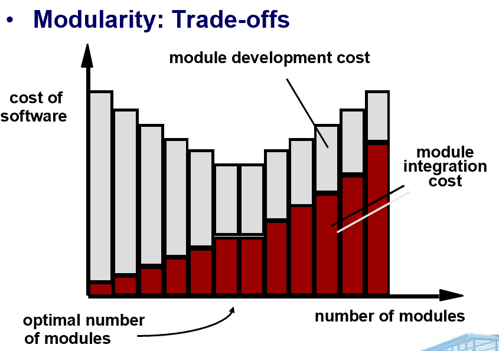

# Chapter 12: Design Concepts

## 12.1 软件设计概述

1. **好的软件设计应具备的特点**
    - **坚固性（Firmness）**：程序不应有影响功能的 bug。
    - **适用性（Commodity）**：程序应适合其预定用途。
    - **愉悦感（Delight）**：使用程序的体验应该是令人愉悦。
2. **什么是软件设计**
    - 定义：软件设计包含一系列引导开发高质量系统的**原则、概念和实践**（**principles, concepts, and practices**）。
    - 解释：设计原则是哲学指导，设计概念是基础，而设计实践则随着新技术和理解的进化而不断变化。
3. **软件设计模型**
    - **数据/类设计（Data/Class Design）**：将分析类转换为实现类和数据结构 。
    - **体系结构设计（Architectural Design）**：定义软件结构元素之间的关系 。
    - **接口设计（Interface Design）**：定义软件、硬件及用户之间的通信方式 。
    - **组件级设计（Component-Level Design）**：将结构元素转换为软件组件的过程描述 。
    
4. **设计与质量**
    - 设计的质量要求
        - 设计必须实现分析模型中所有的显式需求，并容纳客户期望的隐式需求 。
        - 设计必须是可读且易懂的指南，以便于编码、测试和支持 。
        - 设计应从实现的角度提供软件的全貌 。
    - 设计的质量指南
        - 设计的架构应当：
            - 使用可识别的架构风格或模式创建
            - 由展现良好设计特征的组件构成
            - 可以以演进的方式实现
        - 设计应是模块化的，即软件应在逻辑上被划分为多个元素或子系统。
        - 设计应包含数据、架构、接口和组件的不同表示。
        - 设计应产生适合待实现类的数据结构，这些结构应来源于可识别的数据模式。
        - 设计应产生展现独立功能特性的组件。
        - 设计应产生降低组件之间以及与外部环境连接复杂度的接口。
        - 设计应使用可重复的方法推导而来，该方法由软件需求分析期间获得的信息驱动。
        - 设计应使用能有效传达其含义的表示法（Notation）。
5. **软件设计准则**
    - 设计过程不应陷入“隧道视野”（即视野狭窄，只关注局部）。
    - 设计应可追溯到分析模型。
    - 设计不应重复造轮子（即应复用已有的解决方案）。
    - 设计应“最小化软件与现实世界中问题之间的智力距离”。
    - 设计应展现统一性和集成性。
    - 设计应能够适应变化。
    - 设计应能够优雅降级，即使遇到异常数据、事件或操作条件。
    - 设计不是编写代码，编写代码也不是设计。
    - 设计应在创建过程中进行质量评估，而不是事后。
    - 设计应通过评审来最小化概念（语义）错误。
6. **软件设计基本概念**
    - 抽象（Abstraction）：数据、过程、控制（Data，Procedure，Control）
    - 架构（Architecture）：软件的整体结构
    - 模式（Patterns）：“传达”了经过验证的设计解决方案的“精髓”
    - 关注点分离（Separation of Concerns）：任何复杂问题如果被细分成多个部分，都可以更容易地处理
    - 模块化（Modularity）：数据和功能的划分
    - 隐藏（Hiding）：通过设计接口，增加受控性
    - 功能独立性（Functional Independence）：单一功能，高内聚低耦合（single-minded function and low coupling）
    - 细化（Refinement）：对所有抽象进行细节的详细阐述，通过逐步细化（Stepwise Refinement）可以将高层次抽象逐步分解为更详细、更具体的低层次描述，直到可以直接编码实现
    - 方面（Aspects）：一种理解全局需求如何影响设计的机制
    - 重构（Refactoring）：重构是一种在不改变软件外部功能的前提下，优化其内部结构的技术
    - 面向对象的设计概念（OO Design Concepts）
    - 设计类（Design Classes）：提供设计细节，使分析类能够被实现

## 12.2 **软件设计基本概念**

1. **抽象（Abstraction）**
    - 数据抽象（Data Abstraction）：将数据的内部表示细节隐藏起来，只暴露必要的操作接口。
    - 过程抽象（Procedural Abstraction）：将一系列操作步骤用一个函数或方法来封装。
2. **架构（Architecture）**
    - **定义：**软件的整体结构，以及该结构为系统提供概念完整性的方式。
    - 结构属性（Structural properties）：架构设计应定义系统的组件（例如模块、对象、过滤器）以及这些组件如何打包和相互交互的方式。
    - 额外功能属性（Extra-functional properties）：架构设计描述应说明设计架构如何实现性能、容量、可靠性、安全性、适应性及其他系统特性的要求。
    - 相关系统家族（Families of related systems）： 架构设计应借鉴在相似系统家族设计中常见的可重复模式。
3. **模式（Patterns）**
    
    设计模式的模版（Design Pattern Template）由以下要素组成：
    
    - 模式名称（Pattern Name）、别名（Also-Known-As）
    - 意图（Intent）：描述模式及其作用
    - 动机（Motivation）：提供一个问题的示例
    - 适用性（Applicability）：指出模式适用的特定设计情况
    - 结构（Structure）：描述实现模式所需的类
    - 参与者（Participants）：描述实现模式所需类的职责
    - 协作（Collaborations）：描述参与者如何协作以履行其职责
    - 后果（Consequences）：描述影响模式的“设计驱动力”以及实现模式时必须考虑的潜在权衡
    - 相关模式（Related Patterns）
4. **关注点分离（Separation of Concerns）**
    - 任何复杂问题如果被细分成多个可以独立解决和/或优化的部分，都可以更容易地处理。
    - 关注点（Concern）是作为软件需求模型一部分指定的一个特性或行为。
5. **模块化（Modularity）**
    - 模块化是使程序在智力上可管理的唯一软件属性。
    - 模块数并非越多越好，软件开发成本分为模块开发成本与模块集合成本，后者随模块数的增多而增大。
    
    
    
6. **功能独立性（Functional Independence）**
    - 功能独立性是通过开发具有“单一”功能且“厌恶”与其他模块过度交互的模块来实现的。
    - **内聚性（Cohesion）**是衡量模块功能相对强度的指标。
        - 一个高内聚的模块执行一个单一的任务，几乎不需要与程序其他部分的组件交互。简单来说，一个高内聚的模块（理想情况下）应该只做一件事。
    - **耦合性（Coupling）**是衡量模块之间相对相互依赖程度的指标。
        - 耦合度取决于模块之间的接口复杂度、进入或引用模块的点，以及通过接口传递的数据。
7. **方面（Aspects）**
    - 考虑两个需求 A 和 B。需求 A 横切（Crosscut）需求 B，如果已经选择了一种软件细化方式，在这种方式下，如果不考虑 A，就无法满足 B。
    - 横切关注点（Crosscut Concern）是指那些会影响系统多个模块的需求，这些关注点难以用传统的模块化方法封装。“方面”就是对这些横切关注点的建模和封装。

## 12.3 面向对象的设计

### 12.3.1 设计类 **Design Classes**

1. **设计类的类型**
    - **实体类（Entity classes）：** 分析类在设计过程中被细化，成为**实体类**。
    - **边界类（Boundary classes）：** 边界类在设计过程中被开发，用于负责管理实体对象向用户的表示方式，即创建用户在软件使用过程中的交互界面（例如：交互式屏幕或打印报告）。
    - **控制类（Controller classes）：** 负责管理从开始到结束的“工作单元”（Unit of work）。控制类可被设计用于：
        - 管理实体对象的创建或更新 ；
        - 当边界对象从实体对象获取信息时，负责边界对象的实例化
        - 管理对象集之间复杂的通信 ；
        - 以及验证对象之间或用户与应用程序之间通信的数据 。
2. **关键概念**
    - 继承（Inheritance）：父类的所有职责被子类继承。
    - 消息（Messages）：刺激接收对象发生某种行为。
    - 多态（Polymorphism）：一种能大大减少扩展设计所需工作的特性。
3. **设计类的特性**
    - 完整性（Complete）：包含所有必要的属性与方法；充分性（Sufficient）：只包含意图所需的方法。
    - 原语性（Primitiveness）：每个类方法专注于提供某一个服务。
    - 高内聚：类的功能聚焦单一。
    - 低耦合：类之间的合作保持在最低限度。

### 12.3.2 设计模型的元素 Design Model Elements

1. **数据元素（Data Elements）**
    - 研究意义：数据模型 → 数据结构/数据库架构
    - 数据建模（Data Modeling）
        - 独立于处理来考察数据对象
        - 将注意力集中在数据领域
        - 在客户的抽象层次上创建模型
        - 指明数据对象之间如何相互关联
    - 什么是数据对象（Data Object）？
        - 定义：任何必须被软件理解的复合信息的表示。
        - 复合信息（Composite Information）：具有多个不同属性或特征的事物。
        - 数据对象的描述包含了数据对象及其所有属性。
        - 数据对象仅封装数据，数据对象内部不包含作用于数据的操作的引用。
    - 什么是关系（Relationship）？
        - 数据对象之间以不同的方式相互连接。
        - 一个关系可以存在多个实例，对象可以以多种不同的方式关联。
2. **架构元素（Architectural Elements）**
    
    架构模型来源于三个方面：
    
    - 关于待构建软件应用领域的信息；
    - 特定的需求模型元素，例如针对当前问题的数据流图或分析类、它们的关系和协作；
    - 可用的架构模式（第16章）和风格（第13章）。
3. **接口元素（Interface Elements）**
    - **接口** 是一组操作，它描述了一个类的外部可观察行为，并提供对其公共操作的访问。
    - 重要的接口：
        - 用户界面（UI）
        - 与其他系统、设备、网络或其他信息生产者或消费者的外部接口
        - 各个设计组件之间的内部接口
    - 使用 UML 通信图（Communication Diagram）（在 UML 1.x 中称为协作图，Collabortion Diagram）进行建模。
    
    
    
4. **组件元素（Component Elements）**
    - 描述每个组件的内部细节，包括：
        - 所有本地数据对象的数据结构
        - 所有组件处理函数的算法细节
        - 允许访问所有组件操作的接口
    - 使用 UML 组件图（Component Diagram）、UML 活动图（Activity Diagram）、伪代码（Pseudocode，PDL），有时也使用流程图（Flowchart）进行建模。
    
    
    
5. **部署元素（Deployment Elements）**
    - 指示软件功能和子系统将如何在物理计算环境中进行分配
    - 使用 **UML 部署图**进行建模（Deployment Diagram）
        - **描述符形式（Descriptor Form）**的部署图展示计算环境，但不指明配置细节
        - **实例形式（Instance Form）**的部署图标识了具体的命名硬件配置，在设计后期阶段开发。
    
    