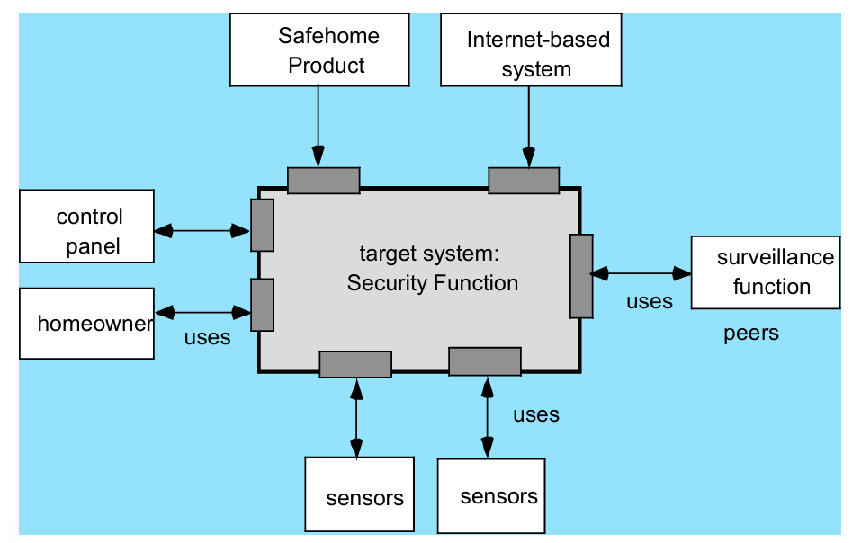

# Chapter 13: Architectural Design

1. **架构的基本概念与定义**
    - **架构非软件实体**：架构本身并不是运行中的软件，而是一种**表现形式（Representation）** 。
    - **核心功能**：架构使软件工程师能够：
        1. 分析设计在满足既定需求方面的有效性 。
        2. 在设计变更相对容易的阶段考虑多种架构方案 。
        3. 降低软件构建相关的风险 。
2. **架构的重要性**
    - **沟通媒介**：软件架构的表现形式是所有利益相关者（Stakeholders）之间沟通的使能工具 。
    - **早期决策影响**：架构突出了早期的设计决策，这些决策对后续所有软件工程工作以及系统的最终成功有着深远影响 。
    - **简洁性**：架构构成了一个规模相对较小、在智力上可把握的模式，展示了系统的结构及组件间如何协同工作 。

**3. 架构描述（Architectural Descriptions, AD）**

- **标准规范**：IEEE-Std-1471-2000 建立了架构设计的概念框架和术语，旨在鼓励良好的设计实践 。
- **定义**：架构描述是记录架构的一组产品集合 。
- **多视图表示**：架构通过多个**视图（Views）** 来表示，每个视图从相关利益相关者的关注点出发，展示整个系统的某个方面 。
1. **架构类别、风格与模式**
    - **架构类别（Genres）**：指软件领域中的特定类别。每个类别下有子类别（例如：建筑类别下有住宅、办公楼等），每个风格都有可预测的模式 。
    - **架构风格（Styles）**：描述了一类系统，包括组件集（如数据库、计算模块）、连接器（实现沟通、协作）、约束条件和语义模型 。
        - **常见风格**：
            - **以数据为中心（Data-centered Architecture）**：如仓库或黑板架构 。
            - **数据流（Data flow Architecture）**：包括管道与过滤器（Pipes and filters）以及批处理序列（Batch sequential）。
            - **调用与返回（Call and return Architecture）**：涉及主程序/子程序或远程过程调用 。
            - **面向对象（Object-oriented Architecture）** 。
            - **分层架构（Layered Architecture）**：包括用户界面层、应用层、实用程序层和核心层 。
    - **架构模式（Patterns）**：
        - **并发性（Concurrency）**：处理多任务（如操作系统进程管理模式、任务调度模式）。
        - **持久化（Persistence）**：数据在进程执行结束后继续存在（如数据库管理系统模式、应用级持久化模式）。
        - **分布性（Distribution）**：组件在分布式环境中的通信方式（如代理人/Broker 模式）。
2. **架构设计过程**
    - **确定上下文**：定义软件与之交互的外部实体（其他系统、设备、人员）及其交互性质 。
        
        
        
        图：Architectural Context
        
    - **识别原型（Archetypes）**：识别代表系统行为抽象元素的架构原型 。
        
        
        
        图：原型
        
    - **指定结构**：设计者通过定义和细化来实现每个软件组件的原型，从而规范系统结构 。
3. **架构设计的核心考量因素**
    - **经济性（Economy）**：最佳软件应精简，依靠抽象减少不必要的细节 。
    - **可见性（Visibility）**：架构决策及其原因应对后续维护的工程师显而易见 。
    - **间距（Spacing）**：实现关注点分离，且不引入隐藏的依赖关系 。
    - **对称性（Symmetry）**：确保系统属性的一致性与平衡 。
    - **涌现性（Emergence）**：关注自组织的行为与控制 。
4. **架构决策与评审**
    - **决策文档化（Architectural Decision Documentation）**：应记录每项决策所需的信息项、与需求的链接、优先级/依赖关系以及受影响的架构视图 。
    - **权衡分析（Tradeoff Analysis）**：收集场景，评估质量属性，识别属性对特定风格的敏感性，并对候选架构进行评审 。
    - **架构评审（Architecture Reviews）**：评估架构满足质量需求的能力并识别风险，通过早期发现问题降低项目成本 。
    - **架构复杂性（Architectural Complexity）：**评估一个提议架构的整体复杂性，主要取决于架构内部组件之间的**依赖关系（Dependencies）**。主要分为以下三类：
        - 共享依赖（Sharing dependencies）：涉及多个消费者使用同一个资源，或多个生产者为同一个消费者提供服务。
        - 流依赖（Flow dependencies）：体现了资源生产者与消费者之间的直接关系（例如：数据从 A 流向 B）。
        - 约束依赖（Constrained dependencies）：指对一组活动之间控制流（Flow of control） 相对顺序的限制或约束。
    - **架构描述语言（ADL）：**ADL 为描述软件架构提供了一套专门的语义（Semantics）和语法（Syntax）。它赋予设计师以下能力：
        - **分解（Decompose）**：将复杂的架构分解为具体的组件。
        - **组合（Compose）**：将单个组件重新组合成更大的架构块（模块化构建）。
        - **表示接口（Represent interfaces）**：定义组件之间的连接机制，即如何进行交互和通信。
    - **基于模式的评审步骤（Patter-Based Architecture Review）**：通过用例讨论质量属性、匹配架构模式、确定模式对质量的影响并汇总问题 。
5. **敏捷开发与架构**
    - **步行骨架（Walking Skeleton）**：在编码前，使用用户故事创建并演化架构模型，以避免返工 。
    - **混合模型**：允许架构师将用户故事贡献到演化中的故事板中 。
    - **代码评审**：在敏捷项目中，对每个 Sprint 产出的代码进行评审也是一种有效的架构评审形式 。