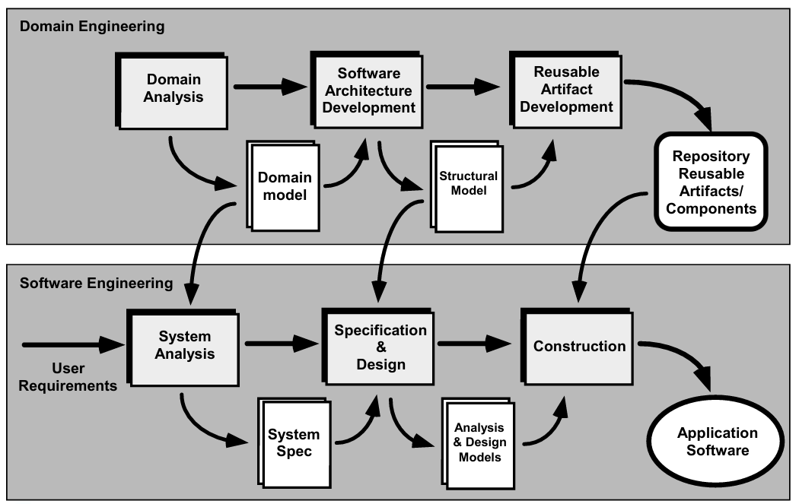

# Chapter 14: Component-Level Design

## 14.1 构件的概念

1. **什么是构件**
    - **OMG UML 定义**：构件是系统的一个模块化、可部署且可替换的部分，它封装了实现并暴露了一组接口。
    - **面向对象（OO）视角**：一个构件包含一组协作的类。
    - **传统视角**：构件包含处理逻辑、实现该逻辑所需的内部数据结构，以及一个允许调用和数据传递的接口。
2. **构件的基本设计原则**
    - **开闭原则（OCP）**：构件允许扩展，而不允许修改。
    - **里氏替换原则（LSP）**：子类应当可以替换其基类。
    - **依赖倒置原则（DIP）**：依赖于抽象，而非具体实现。
    - **接口隔离原则（ISP）**：多个针对特定客户的接口优于一个通用的单一接口。
    - **发布重用等价原则（REP）**：重用的粒度（granule）就是发布的粒度。
    - **共同封闭原则（CCP）**：一起修改的类应当封装在一起。
    - **共同重用原则（CRP）**：不在一起重用的类不应组合在一起。
3. **构件的设计指南**
    - **构件命名**：建立统一的命名规范，从架构模型细化到构件模型。
    - **接口设计**：接口是沟通和协作的关键，有助于实现开闭原则（OCP）。
    - **依赖与继承**：建议从左到右建模依赖关系，从下到上建模继承关系。
4. **内聚性与耦合性**
    - **内聚性（Cohesion）**
        - **传统视角：**模块功能的“单一性”。
        - **面向对象视角**：构件或类仅封装相互紧密关联的属性和操作。
        - **内聚级别（由高到低）**：功能内聚、分层内聚、通信内聚、顺序内聚、过程内聚、时间内聚、实用内聚。
    - **耦合性（Coupling）**
        - **定义**：构件之间以及与外部世界连接的紧密程度。
        - **耦合级别（由低到高）**：外部耦合、包含/导入耦合、类型使用耦合、子程序调用耦合、数据耦合、标记（Stamp）耦合、控制耦合、公共（Common）耦合、内容耦合。

## 14.2 构件级设计

1. **构件级设计的步骤**
    - **识别类**：识别与问题域和基础设施域对应的所有设计类。
    - **细化类**：对非重用构件进行细化，指定消息细节，识别接口。
    - **详细描述**：定义数据类型/结构，描述每个操作的处理流。
    - **持久化设计**：描述数据库、文件等持久化数据源及管理类。
    - **行为建模**：开发构件的行为表示（如状态图）。
    - **部署细化**：细化部署图（Deployment Diagram）以提供实现细节。
    - **重构与权衡**：考虑替代设计方案。
2. **Web 应用的构件级设计**
    - **WebApp 构件的定义：**操作内容的凝聚功能，或内容与功能的凝聚包。
    - **WebApp 的构件级设计包含：**
        - **内容设计（Content Design）**：侧重于内容对象的打包，如 SafeHome 中的平面图、摄像头图标等。
        - **功能设计（Functional Design）**：包括动态内容生成、业务逻辑处理、数据库查询及外部接口。
    - **客户端类型**：瘦客户端（仅界面层）与胖客户端（界面、业务、数据层均在设备上）。
3. **重用的障碍（Impediments to Reuse）**
    - 开发团队在考虑重用时会询问：是否有现成的商业构件（COTS）？内部开发的重用构件是否满足要求？接口是否兼容？
    - **障碍**：缺乏重用计划、缺乏工具使用、培训不足、认为重用麻烦、方法论不支持以及缺乏激励机制。

## 14.3 领域工程

1. **领域工程（Domain Engineering）**
    
    
    
    - **领域工程（Domain Engineering）**：其目标是建立“资产库”。它不针对某个特定项目，而是通过分析整个应用领域（如：财务系统、安防系统），识别出通用的需求和构件，并将这些构件存入**存储库（Repository）** 。
    - **软件工程（Software Engineering）**：即应用工程。开发人员从存储库中提取现成构件，结合用户需求进行系统分析、设计和构造，最终交付应用软件 。
    - **关键点**：领域工程是“生产者”，软件工程是“消费者”。
2. **领域工程的具体步骤（Domain Engineering Steps）**
    
    这一页详细说明了如何进行领域工程，以便发现复用机会：
    
    - **步骤 1-2：定义与分类**：首先确定要研究的领域边界（如：图像处理领域），然后对提取出的项（功能、数据、对象）进行分类 。
    - **步骤 3-4：收集与分析样本**：收集该领域内现有的代表性应用，分析它们共有的特征、模式和算法 。
    - **步骤 5：开发分析模型**：为这些通用的对象和行为建立模型，作为后续开发可复用构件的蓝图 。
3. **识别可复用构件（Identifying Reusable Components）**
    
    在设计新构件时，工程师需要通过以下问题评估其“复用潜力”：
    
    - **通用性评估**：该功能在未来实现中是否需要？在领域内是否常见？是否存在功能重复？
    - **硬件依赖性**：构件是否依赖特定硬件？能否将硬件相关代码剥离到独立构件中以提高通用性？
    - **可参数化**：能否通过增加参数（Parameterize）使非通用构件变得通用？
    - **分解与修改**：通过分解复杂构件或进行微小修改，是否能获得更高价值的可复用资产？

## 14.4 基于构件的软件工程 CBSE

1. **基于构件的软件工程（Component-Based SE）**
    
    要实现真正的 CBSE，必须具备三个基本要素：
    
    - **构件库**：必须有一个可供检索的构件库 。
    - **一致的结构**：库中的构件必须遵循统一的结构规范，以便于组合 。
    - **互操作标准**：必须存在行业标准，确保不同来源的构件能协同工作，例如 **OMG/CORBA**、**Microsoft COM** 或 **Sun JavaBeans**
2. **CBSE 的四大核心活动（CBSE Activities）**
    - **构件限定（Qualification）**：评估第三方构件是否满足需求。
    - **构件适配（Adaptation）**：对选定的构件进行微调，解决接口不匹配的问题。
    - **构件组合（Composition）**：将多个构件集成到统一的架构中。
    - **构件更新（Update）**：随着需求变化，替换或升级系统中的构件。
3. **构件限定（Component Qualification）**
    
    这是在将构件引入系统之前的“背景审查”，主要评估：
    
    - **接口与工具**：API 是否清晰？开发工具是否支持？
    - **运行要求**：对内存、存储、资源的使用情况，以及支持的协议 。
    - **服务与安全性**：操作系统接口要求、访问控制和身份验证协议 。
    - **健壮性**：异常处理能力和内部采用的算法假设 。
4. **构件适配（Component Adaptation）**
    
    即使限定合格，构件往往也无法直接“即插即用”。适配的目标是实现“易集成”：
    
    - **资源管理一致性**：确保所有构件使用统一的资源管理方法 。
    - **通用活动一致性**：如数据管理、错误处理等应遵循统一模式 。
    - **接口一致性**：确保架构内部接口与外部环境接口的实现方式一致
5. **构件组合（Component Composition）**
    
    这涉及到如何将构件“粘合”在一起。架构中必须包含：
    
    - **数据交换模型**：构件间如何传递数据。
    - **自动化与存储**：支持自动化操作和结构化存储。
    - **底层对象模型**：定义构件交互的基本哲学 。
6. **互操作标准**
    - OMG/CORBA 标准
        - 定义：公用对象请求代理体系结构（Common Object Request Broker Architecture） 。
        - 核心构件 - ORB：对象请求代理（ORB）充当“中间人”，允许不同位置、不同平台的构件相互通信 。
        - IDL（接口定义语言）：为每个构件创建 IDL 接口是实现“无缝集成”的关键，确保调用者无需关心构件的内部实现 。
        - 架构图（P31）：展示了客户端（Client）通过 IDL Stubs 发起请求，ORB 核心（Core）负责寻址，服务器端通过 Object Adapter 响应请求的过程 。
    - Microsoft COM 标准
        - COM（构件对象模型）：是 Windows 环境下的一套规范，允许不同厂商开发的构件在单个应用中协作 。
        - 组成要素：包括 COM 接口（作为 COM 对象实现）以及一套用于注册接口和在接口间传递消息的机制 。
    - Sun JavaBeans 标准
        - 特点：可移植、平台无关，完全基于 Java 语言 。
        - BDK（Bean 开发工具箱）：一套支持工具，允许开发人员分析现有的 Bean、自定义其外观和行为、建立通信机制，并在特定应用中进行测试 。
7. **分类与索引（Classification & Indexing）**
    
    为了方便在库中找到构件，需要科学的分类法：
    
    - **枚举分类（Enumerated）**：定义一个分层的树状结构（类、子类） 。
    - **刻面分类（Faceted）**：基于一系列描述性特征（特征维）来定义构件 。
    - **属性值分类（Attribute-value）**：为特定领域的构件定义一组固定的属性及其取值范围 。
    - **索引**：为分类后的构件建立索引，以实现快速检索。
8. **重用环境（The Reuse Environment）**
    
    一个完整的重用环境由以下部分组成：
    
    - **构件数据库**：存储构件及其分类信息 。
    - **库管理系统**：提供对数据库的访问控制 。
    - **检索系统**：（如 ORB）使客户端能从服务器获取所需的构件和服务 。
    - **CBSE 工具**：支持将检索到的复用构件集成到新设计或实现中 。