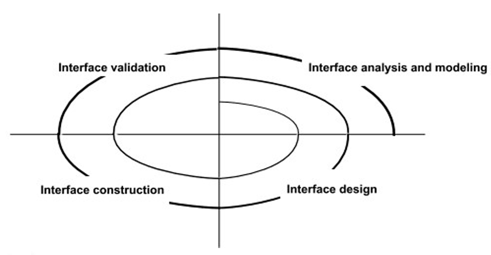

# Chapter 15: User Interface Design

## 15.1 用户界面设计概述

1. **典型的设计错误**
    - 缺乏一致性
    - 需要过多的记忆
    - 没有引导或帮助信息
    - 缺乏上下文敏感性
    - 响应速度差
    - 晦涩难懂且不友好
2. **用户界面设计的黄金法则**
    
    法则一：让用户拥有控制权
    
    - 定义交互模式，不要强迫用户执行不必要或非预期的操作 。
    - 提供灵活的交互方式 。
    - 允许用户交互是可中断且可撤销的 。
    - 随着技能水平的提高，精简交互过程并允许自定义交互 。
    - 对普通用户隐藏技术细节 。
    - 设计能与屏幕上出现的对象直接交互的方案 。
    
    法则二：减轻用户的记忆负担
    
    - 减少对短时记忆的需求 。
    - 建立有意义的默认值 。
    - 定义直观的快捷键 。
    - 界面的视觉布局应基于现实世界的隐喻 。
    - 以渐进的方式披露信息 。
    
    法则三：保持界面一致性
    
    - 允许用户将当前任务置于有意义的上下文中 。
    - 在系列应用中保持一致性 。
    - 如果过去的交互模型已经建立了用户的预期，除非有迫切的理由，否则不要轻易更改 。
3. **用户界面设计模型（UI Design Models）**
    - **用户模型（User model）**：系统所有终端用户的轮廓 。
    - **设计模型（Design model）**：用户模型在设计上的实现 。
    - **心理模型/系统感知（Mental model）**：用户对界面是什么的心理映射 。
    - **实现模型（Implementation model）**：界面的“外观和感觉”，以及描述界面语法和语义的辅助信息 。

## **15.2 用户界面设计过程 UI Design Process**

1. **界面分析（Interface Analysis）**
    
    界面分析意味着理解以下四个方面：
    
    - 通过界面与系统交互的**人**（终端用户）；
    - 终端用户为完成工作必须执行的**任务**；
    - 作为界面一部分呈现的**内容**；
    - 执行这些任务的**环境** 。
2. **用户分析（User Analysis）**
    - 用户是受过训练的专业人士、技术人员、文职人员还是生产线工？
    - 平均受教育程度如何？
    - 用户能否通过书面材料学习，或者他们是否表达了对课堂培训的需求？
    - 用户是打字专家还是对键盘有恐惧感？用户的年龄范围如何？
    - 是否以某一性别为主？如何获得报酬？
    - 是正常办公时间工作，还是直到完成工作为止？
    - 该软件是工作的核心部分，还是偶尔使用？
    - 用户的主要母语是什么？操作失误的后果是什么？
    - 用户是否是系统涉及领域的专家？
    - 用户是否想了解界面背后的技术？
3. **任务分析与建模（Task Analysis and Modeling）**
    - **用例（Use-cases）**：定义基本交互 。
    - **任务详述（Task elaboration）**：细化交互任务 。
    - **对象详述（Object elaboration）**：识别界面对象（类） 。
    - **工作流分析（Workflow analysis）**：定义涉及多人及多角色时的任务完成过程 。
4. **泳道图（Swimlane Diagram）**
    
    用于描述任务流中不同参与者的协作（如处方续方流程） 。
    
    
    
5. **显示内容分析（Analysis of Display Content）**
    - 不同类型的数据是否被分配到屏幕上一致的地理位置（例如，照片总是显示在右上角）？
    - 用户可以自定义内容的屏幕位置吗？
    - 所有内容都被正确地标识了屏幕识别吗？
    - 如果要呈现一份大型报告，应如何划分以便理解？
    - 是否会有机制直接迁移到大量数据的汇总信息。
    - 图形输出会根据所用显示设备的范围进行缩放吗？
    - 颜色将如何用来增强理解？
    - 错误信息和警告将如何向用户展示？
6. **界面设计步骤（Interface Design Steps）**
    - 利用界面分析中获得的信息，定义界面对象和动作（操作）。
    - 定义事件（用户操作），这些事件会导致用户界面状态发生变化。以身作则。
    - 描绘每个接口状态，以它实际呈现给终端用户的样子。
    - 说明用户如何根据接口提供的信息解读系统状态。
7. **设计问题**
    - 响应时间
    - 帮助设施
    - 错误处理
    - 菜单和命令标签
    - 应用可访问性
    - 国际化
8. **设计——评估循环（Design Evaluation Cycle）**
    
    