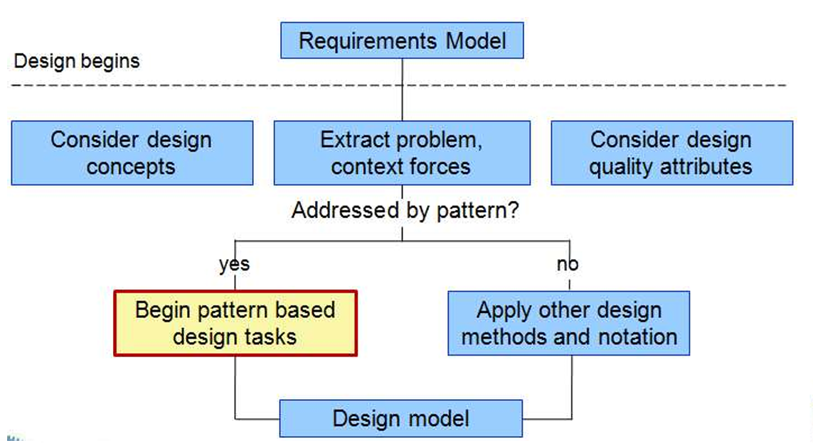

# Chapter 16: Pattern-Based Design

## 16.1 设计模式 Design Patterns

<aside>
💡

设计模式是一种描述问题及其解决方案的编纂方法，它允许软件工程社区捕获设计知识，并以能够重复利用的方式进行传播。

</aside>

1. **基本概念**
    
    一个由三部分组成的规则，表达了特定**环境（Context）**、**问题（Problem）**和**解决方案（Solution）**之间的关系。
    
    - **环境（Context）**：允许读者理解问题所处的环境，以及在该环境下什么解决方案可能是合适的。
    - **作用力系统（A system of forces）**：一组需求，包括限制和约束，它们会影响：
        - 在特定环境下如何解读该问题。
        - 如何有效地应用解决方案。
2. **有效设计模式的特征**
    - 它解决了一个问题：不仅仅是抽象的原则或策略。
    - 它是一个经过验证的概念：不是理论或推测。
    - 解决方案并非显而易见：间接地为问题生成解决方案——这是解决最困难设计问题的必要方法。
    - 它描述了一种关系：不仅描述模块，还描述更深层的系统结构和机制。
    - 模式具有显著的人文因素：显式地诉诸于美学和实用性（尽量减少人工干预）。
3. **生成式模式的种类（Generative Patterns）**
    - 架构模式（Architectural patterns）：描述使用结构化方法解决的大范围设计问题。
    - 数据模式（Data patterns）：描述经常出现的数据导向问题以及可用于解决这些问题的建模方案。
    - 构件模式（Component patterns）：也称为设计模式，解决与子系统和构件开发、它们之间的通信方式以及它们在大型架构中的布局相关的问题。
    - 界面设计模式（Interface design patterns）：描述常见的用户界面问题及其解决方案，包含针对特定终端用户特征的作用力系统。
    - WebApp 模式：解决在构建 Web 应用时遇到的一系列问题，通常包含上述许多其他模式类别。
4. **模式的分类**
    - **创建型模式（Creational patterns）**：关注对象的创建、组合和表示。
        - **抽象工厂模式（Abstract factory pattern）**：集中决定实例化哪种工厂。
        - **工厂方法模式（Factory method pattern）**：集中创建特定类型的对象，并从多种实现中选择一种。
    - **结构型模式（Structural patterns）**：关注与类和对象如何组织及集成以构建更大结构相关的问题和解决方案。
        - **适配器模式（Adapter pattern）**：将一个类的接口“适配”成客户端期望的另一个接口。
        - **聚合模式（Aggregate pattern）**：组合模式的一个版本，具有聚合子节点的方法。
    - **行为型模式（Behavioral patterns）**：解决与对象之间的职责分配以及对象间通信方式相关的问题。
        - **责任链模式（Chain of responsibility pattern）**：命令对象由包含逻辑的处理对象处理或传递给其他对象。
        - **命令模式（Command pattern）**：命令对象封装一个动作及其参数。
5. **框架（Frameworks）**
    - 一种针对特定实现的、用于设计工作的骨架基础设施（Skeletal Infrastructure）。
    - 一种“可重用的微架构，为一系列软件抽象提供通用的结构和行为，以及一个规定了它们在给定领域内的协作和使用的环境。”
    - 它不是一种架构模式，而是一个带有“插槽”（Plug Points，also called hooks and slots）的骨架，使其能够适应特定的问题领域。 插槽使开发者能够在骨架中集成特定于问题的类或功能。
6. **设计模式的描述**
    
    通常包含以下信息：
    
    - 模式名称（Pattern name）
    - 问题（Problem）
    - 动机（Motivation）
    - 环境（Context）
    - 作用力（Forces）
    - 解决方案（Solution）
    - 意图（Intent）
    - 协作（Collaborations）
    - 结果（Consequences）
    - 实现（Implementation）
    - 已知应用（Known uses）
    - 相关模式（Related patterns）

## 16.2 基于模式的软件设计 Pattern-Based Software Design

1. **上下文中的基于模式设计（Pattern-Based Design in Context）**
    
    
    
2. **模式思维与设计任务（Thinking in Patterns and Design Tasks）**
    - **步骤 1**：确保你理解大局——软件所处的环境。
    - **步骤 2**：检查大局，提取该抽象层次上存在的模式。
    - **步骤 3**：从“大局”模式开始设计，为后续设计工作建立环境或骨架。
    - **步骤 4**：“从环境向内工作”，寻找有助于设计方案的低抽象层次模式。
    - **步骤 5**：重复步骤 1 到 4，直到完成详细设计。
    - **步骤 6**：通过使每个模式适应你正在构建的软件的具体情况来完善设计。
3. **常见的设计错误**
    - 没有花足够的时间去理解底层问题、其环境和作用力，导致选择了一个看起来正确但不适合所需方案的模式。
    - 一旦选错了模式，拒绝承认错误并强行套用该模式。
    - 问题的作用力未被所选模式考虑，导致匹配效果差或错误。
    - 过于照搬模式，未针对问题空间进行必要的适配。
4. **模式组织表（Pattern Organization Table）**
    
    
    

## 16.3 架构模式 Architectural Patterns

架构模式处理诸如并发、持久性和分布等问题。

- **示例：房屋与厨房模式**。厨房模式及其协作模式解决与食物存储、准备、所需工具以及工具在房间内相对于工作流的布局规则相关的问题。

## 16.4 组件级模式 Component-Level Patterns

- 构件级设计模式提供了一种经过验证的解决方案，解决从需求模型中提取的一个或多个子问题。
- 此类模式通常关注系统的某些功能元素。
- **示例**：如何获取 SafeHome 设备的规格和相关信息？
    - 搜索相关模式：AdvancedSearch, HelpWizard, SearchResults, SearchBox 等。

## 16.5 UI 模式 User Interface Patterns

- **整体 UI（Whole UI）**：为整个界面的顶层结构和导航提供设计指导。
- **页面布局（Page layout）**：处理页面或屏幕显示的总体组织。
- **表单与输入（Forms and input）**：考虑各种完成表单级输入的技巧。
- **表格（Tables）**：为创建和操作各种表格数据提供指导。
- **直接数据操作（Direct data manipulation）**：处理数据编辑、修改和转换。
- **导航（Navigation）**：协助用户在菜单、网页和交互屏幕中导航。
- **搜索（Searching）**：实现对网站或数据存储内容的搜索。
- **电子商务（E-commerce）**：专门针对网站，实现电子商务应用中循环出现的元素。

## 16.6 Web 应用模式 WebApp Patterns

- **信息架构模式（Information architecture patterns）**：涉及信息空间的整体结构以及用户与信息的交互方式。
- **导航模式（Navigation patterns）**：定义导航链接结构，如层次结构、环形、路径等。
- **交互模式（Interaction patterns）**：关于界面如何告知用户操作后果、如何根据环境扩展内容、如何描述链接目标以及告知交互状态。
- **展示模式（Presentation patterns）**：关于如何组织 UI 控制功能以提高易用性，以及展示操作与内容对象之间的关系。
- **功能模式（Functional patterns）**：定义 WebApp 内的工作流、行为、处理、通信和其他算法元素。

## 16.7 移动应用模式 Mobile Apps Patterns

- **移动 UI 模式**：签到屏幕、地图、弹出层（Popovers）、注册流程、自定义标签导航、邀请等。
- **其他模式**：活动对象（Active Objects）、应用控制器（Applications Controller）、数据传输对象（Data Transfer Object）、模型-视图-控制器（MVC）、同步、可靠会话等。