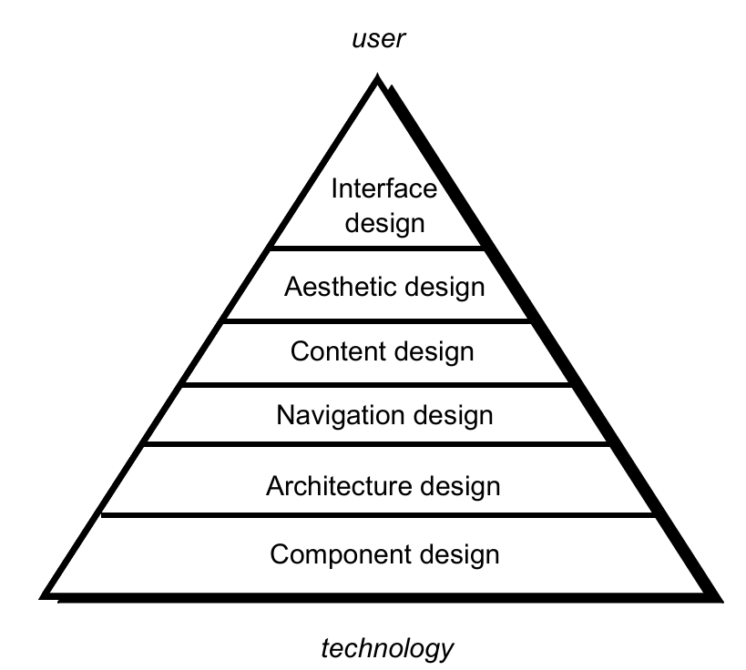

# Chapter 17: WebApp Design

## 17.1 WebApp 设计

1. **我们什么时候应该强调 Web 应用设计？**
    - 当内容和功能较为复杂时。
    - 当 Web 应用的规模涵盖数百个内容对象、功能和分析类时。
    - 当 Web 应用的成功将对业务的成功产生直接影响时。
2. **WebApp 设计质量要求**
    - 安全性（Security）
        - 抵御外部攻击。
        - 排除未经授权的访问。
        - 确保用户/客户的隐私。
    - 可用性（Availability）
        - 衡量 Web 应用可供使用的时间百分比。
    - 可伸缩性（Scalability）
        - Web 应用及其接口系统能否处理用户量或交易量的显著变化？
    - 上市时间（Time to Market）
3. **面向终端用户的质量要求**
    - 时间（Time）
        - 自上次升级以来，网站发生了多少变化？
        - 如何突出显示网站作出更改的部分？
    - 结构性（Structural）
        - 网站的所有部分结合得有多好。
        - 网站内部和外部的所有链接是否都能正常工作？
        - 所有图片都能正常显示吗？
        - 网站中是否存在未连接的部分？
    - 内容（Content）
        - 关键页面的内容是否与预期一致？
        - 在高度变化的页面中，关键短语是否持续存在？
        - 关键页面在不同版本间是否保持了高质量内容？
        - 动态生成的 HTML 页面情况如何？
    - 准确性与一致性（Accuracy and Consistency）
        - 今天下载的页面副本与昨天的一样吗？是否足够接近？
        - 呈现的数据是否足够准确？你如何确定？
    - 响应时间与延迟（Response Time and Latency）
        - 网站服务器是否在特定参数内响应浏览器请求？
        - 在电子商务背景下，点击“提交”后的端到端响应时间如何？
        - 网站中是否存在某些部分速度太慢，导致用户放弃继续操作？
    - 性能（Performance）
        - “浏览器-网络-网站-网络-浏览器”这一连接过程是否足够快？
        - 性能如何随时间段、负载和使用情况而变化？
        - 性能对于电子商务应用是否充足？
4. **WebApp 设计目标**
    - 简洁性（Simplicity）
    - 一致性（Consistency）
        - 内容的构建应当保持一致。
        - 平面设计（美学）应在 Web 应用的所有部分呈现一致的外观。
        - 架构设计应建立模板，从而引导出一致的超媒体结构。
        - 界面设计应定义一致的交互、导航和内容显示模式。
        - 导航机制应在所有 Web 应用元素中一致地使用。
    - 身份标识（Identity）：建立一个适合业务目的的“身份”。
    - 健壮性（Robustness）：用户期望获得与自身需求相关的健壮内容和功能。
    - 可导航性（Navigability）：以直观且可预测的方式进行设计。
    - 视觉吸引力（Visual appeal）：内容的外观、界面布局、色彩协调，以及文本、图形和其他媒体的平衡，导航机制必须吸引最终用户。
    - 兼容性（Compatibility）：兼容所有适当的环境和配置。

## 17.2 WebApp 设计金字塔（Pyramid）

<aside>
💡

- 界面设计（Interface design）
- 审美设计（Aesthetic design）
- 内容设计（Content design）
- 导航设计（Navigation design）
- 架构设计（Architecture design）
- 组件设计（Component design）
</aside>

### 17.2.1 界面设计 Interface design

1. **WebApp 界面设计目标**
    - 我在哪里？ 界面应当：
        - 指示当前访问的是哪个Web应用。
        - 告知用户其在内容层级中的位置。
    - 我现在能做什么？ 界面应始终帮助用户理解当前的选项：
        - 有哪些可用功能？
        - 哪些链接是有效的？
        - 哪些内容是相关的？
    - 我刚才在哪里，我要去哪里？ 界面必须促进导航：
        - 提供一张“地图”（以易于理解的方式实现），显示用户去过的地方以及可以通往Web应用其他部分的路径。
2. **有效的 WebApp 界面**
    - 有效的界面在视觉上是显而易见的，并且具有包容性，能让用户产生掌控感。用户能快速看到选项的范围，掌握如何实现目标并完成工作。
    - 有效的界面不会让用户关注系统的内部运作。工作被仔细且持续地保存，并允许用户随时撤销任何活动。
    - 有效的应用和服务在执行最大量工作的同时，要求用户提供最少的信息。
3. **界面设计原则**
    - 预期（Anticipation）：Web应用的设计应能预测用户的下一步行动。
    - 沟通（Communication）：界面应传达由用户发起的任何活动的状态。
    - 一致性（Consistency）：导航控件、菜单、图标和美学（如颜色、形状、布局）的使用保持一致。
    - 受控的自主性（Controlled autonomy）：界面应促进用户在Web应用中的移动，但应以强制执行为应用建立的导航公约的方式进行。
    - 效率（Efficiency）：Web应用及其界面的设计应优化用户的工作效率，而不是设计它的Web工程师或执行它的客户端-服务器环境的效率。
    - 焦点（Focus）：Web应用界面（及其呈现的内容）应集中于当前的用户任务。
    - 菲茨定律（Fitt’s Law）：“获取目标的时间是到目标的距离和目标大小的函数。”
    - 人机界面对象（Human interface objects）：已为Web应用开发了大量可重用的人机界面对象库。
    - 减少延迟（Latency reduction）：Web应用应以一种让用户觉得操作已完成的方式使用多任务处理，从而继续工作。
    - 易学性（Learnability）：Web应用界面的设计应尽量减少学习时间，一旦学会，应尽量减少重新访问时所需的重复学习。
    - 维护工作产品完整性（Maintain work product integrity）：工作产品（如用户填写的表单、指定的列表）必须自动保存，以免发生错误时丢失。
    - 可读性（Readability）：通过界面呈现的所有信息都应适合老少阅读。
    - 状态跟踪（Track state）：在适当情况下，应跟踪并存储用户交互状态，以便用户注销后返回时能从上次中断的地方继续。
    - 可见导航（Visible navigation）：设计良好的Web应用界面提供一种“用户就在原地，工作被送到他们面前”的错觉。

### 17.2.2 审美设计 Aesthetic design

- 不要害怕留白。
- 强调内容。
- 按从左上到右下组织布局元素。
- 在页面内按地理区域对导航、内容和功能进行分组。
- 不要使用滚动条来扩展你的地盘。
- 设计布局时考虑分辨率和浏览器窗口大小。

### 17.2.3 内容设计 Content design

1. **内容设计的范畴**
    - 为内容对象开发设计表示。
        - 对于Web应用，内容对象与传统软件的数据对象联系更紧密。
    - 表示实例化它们之间关系所需的机制。
        - 类似于第 11 章中描述的分析类与设计组件之间的关系。
    - 内容对象具有属性，包括特定于内容的属性和作为设计一部分指定的特定于实现的属性。

### 17.2.4 架构设计 Architecture design

1. **架构设计的范畴**
    - 内容架构（Content architecture）侧重于内容对象（或复合对象，如网页）为呈现和导航而组织的结构方式。
        - 信息架构（Information architecture）一词也用于表示能更好地组织、标记、导航和搜索内容对象的结构。
    - Web 应用架构（WebApp architecture）阐述应用如何构建以管理用户交互、处理内部任务、实现导航和呈现内容。
    - 架构设计与界面设计、审美设计和内容设计等设计环节 并行 进行。
2. **MVC Architecture**
    - 模型（Model）：包含所有特定于应用的内容和处理逻辑，包括
        - 所有内容对象。
        - 访问外部数据/信息源。
        - 所有特定于应用的逻辑处理功能。
    - 视图（View）：包含所有特定于界面的功能，并实现
        - 内容和处理逻辑的呈现。
        - 访问外部数据/信息源。
        - 最终用户所需的所有处理功能。
    - 控制器（Controller）：管理对模型和视图的访问，并协调它们之间的数据流。
    
    
    

### 17.2.5 导航设计 Navigation design

1. **导航设计的范畴**
    - 始于对用户层级和相关用例的考虑。
        - 每个参与者（Actor）使用 Web 应用的方式可能略有不同，因此有不同的导航需求。
    - 当每个用户与 Web 应用交互时，会遇到一系列导航语义单元（NSU，Navigation Semantic Units）。
        - NSU：一组信息和相关的导航结构，它们协作完成一组相关的用户需求。
2. **导航语义单元（NSU）**
    - **导航方式（Ways of Navigation, WoN）：**代表具有特定概况的用户实现其目标或子目标的最佳导航路径。由通过**导航链接（Navigation Links）**连接的**导航节点（NN, Navigation Nodes）**组成。
    
    
    
3. **导航语法（Navigation Syntax）**
    - **单个导航链接**：文本链接、图标、按钮和开关、图形隐喻等。
    - **水平导航栏**：在包含适当链接的条栏中列出主要内容或功能类别。通常列出 4 到 7 个类别。
    - **垂直导航列**：列出主要内容或功能类别；列出 Web 应用中几乎所有主要内容对象。
    - **选项卡（Tabs）**：一种隐喻，实质上是导航栏或导航列的变体，将内容或功能类别表示为选项卡，在需要链接时进行选择。
    - **站点地图（Site maps）**：为导航到 Web 应用中包含的所有内容对象和功能提供全方位的目录。

### 17.2.6 组件设计 Component design

1. **组件设计的范畴**
    
    Web 应用组件实现以下功能：
    
    - 执行局部处理以动态生成内容和导航能力。
    - 提供适合 Web 应用业务领域的计算或数据处理能力。
    - 提供复杂的数据库查询和访问。
    - 建立与外部企业系统的数据接口。
2. **面向对象的超媒体设计方法（OOHDM，Object-Oriented Hypermedia Design Method）**
    
    
    
3. **概念模式（Conceptual Schema）**
    
    