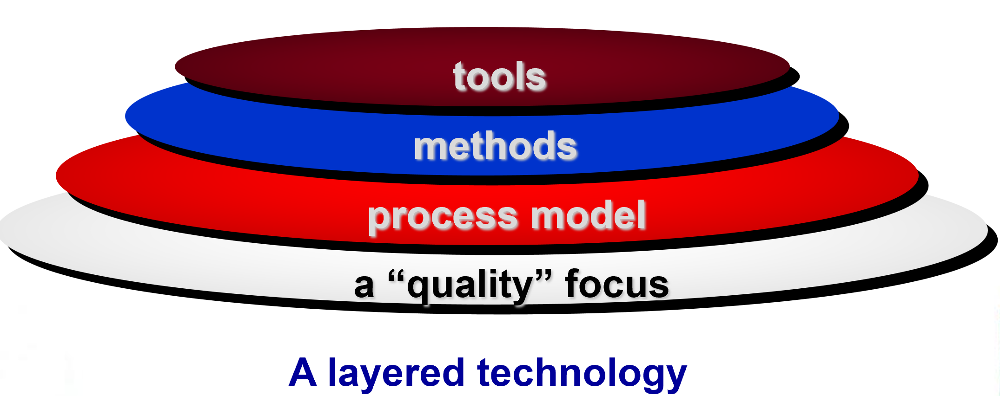

# Chapter 2: Software Engineering

## 2.1 Defining the Discipline 软件工程学科定义

1. **IEEE 对软件工程的定义**
    - 将系统化、严谨且可量化的方法应用于软件的开发、运行和维护，即工程学思想在软件领域的应用。（The application of a **systematic, disciplined, quantifiable** approach to the **development, operation, and maintenance** of software）
    - 同时也指对上述方法的研究。
2. **软件工程的分层技术**
    
    软件工程是一门分层的技术（A layered technology），包括质量关注点 (Quality Focus)、过程模型 (Process Model)、方法 (Methods) 和工具 (Tools/CASE) 。
    
    
    
    - **质量关注点**：保证交付高质量的产品。
    - **过程模型**：定义框架与工作流（Road Map），规定了软件开发过程必须完成哪些任务（如：沟通、策划、建模、构建、部署），以保证准时、高质量交付。
    - **模式**：包含具体的技术方法，提供“如何做”方案（Technical how-to）。
    - **工具**：位于最顶层，为过程和方法提供自动或半自动的支持，例如 IDE、git 等，又称 CASE（Compter-Aided Software Engineering）。

## 2.2 The Software Process 软件过程

1. **通用过程框架（Generic Process Framework）**
    
    通用过程框架由如下**框架活动**（Framework Activities）组成：
    
    - **沟通**（Communication）：与客户协作，收集需求 。
    - **策划**（Planning）：制定工作计划，描述技术风险，列出资源需求和进度 。
    - **建模**（Modeling）：创建模型以帮助理解需求和软件设计 。
    - **构建**（Construction）：代码生成和测试 。
    - **部署**（Deployment）：交付软件供客户评估和反馈 。
2. **框架活动（Framework Activities）**
通用过程框架中每一个框架活动包含多个**动作**（Action），每个动作下设具体的**任务集**（Task Set）。其中，任务集的组成要素包括：
    - **工作任务**（Work tasks）：明确具体要做什么（例如：绘制 E-R 图）。
    - **工作产品**（Work products）：产出什么成果（例如：代码或文档）。
    - **里程碑与交付物**（Milestones & deliverables）：设定关键时间节点。
    - **质量保证检查点**（QA checkpoints）：通过质检，确保错误不流向下一阶段 。
3. **普适性活动（Umbrella Activities）**
它们不属于“通用过程框架”的某个特定的框架活动，而是贯穿整个软件生命周期。它们确保项目的进度、质量和风险得到有效控制。
    - **软件项目管理**（Project management）：负责跟踪进度、分配资源、协调团队，确保项目不延期、不超支。
    - **软件质量保证**（Quality assurance, QA）：通过审计和报告，确保开发过程遵循了既定的标准。
    - **正式技术评审**（Formal technical reviews）：团队成员坐在一起检查代码或设计方案，在错误转化为缺陷之前发现它们。
    - **软件配置管理**（Configuration management）：管理软件的版本。例如使用 Git 记录代码的每一次修改，防止代码被覆盖或丢失。
    - **工作产品生产**（Work product production）：创建那些辅助开发和管理的非代码文档（如用户手册、测试报告）。
    - **可重用性管理**（Reusability management）：寻找可以复用的组件，以提高开发效率。
    - **度量**（Measurement）：用数据说话。统计代码行数、错误率、开发工时等，用于评估项目状态。
    - **风险管理**（Risk management）：预判可能出现的问题（如核心成员离职、技术方案不可行），并制定备选方案。
4. **过程框架的适配（Process Adaptation）**
    
    “过程适配”，就是根据实际情况，对上述标准化的开发流程进行灵活调整，需考虑以下 9 个维度：
    
    1. 任务流与依赖关系（Flow & Interdependencies）
        - **内容**：确定各项活动、动作和任务的整体执行顺序，以及它们之间是如何相互影响的。
        - **适配点**：是采用线性的顺序流（如瀑布模型），还是迭代循环的流（如敏捷开发）？
    2. 定义深度（Definition of Actions and Tasks）
        - **内容**：在每个框架活动中，具体的动作和任务被定义的明确程度。
        - **适配点**：对于需求极其明确的项目，可以定义得非常死；对于探索性项目，则只需给出大框架。
    3. 工作产品的要求（Work Products）
        - **内容**：明确哪些中间产物（如文档、模型、代码段）是必须交付和被标识的。
        - **适配点**：初创团队可能只需要代码和基本的说明，而航空航天等高安全领域的项目则需要详尽的规格说明书。
    4. 质量保证的应用（Quality Assurance）
        - **内容**：QA活动（如代码评审、单元测试、集成测试）的实施方式。
        - **适配点**：是进行全方位的形式化评审，还是仅进行简单的走查？
    5. 项目跟踪与控制（Project Tracking and Control）
        - **内容**：如何监控进度并进行调整。
        - **适配点**：是每天开站立会（Daily Stand-up），还是每周提交进度报告？
    6. 详细程度与严谨性（Detail and Rigor）
        - **内容**：过程描述的精细化程度以及执行过程中的纪律性要求。
        - **适配点**：大型项目通常需要极高的严谨性（Rigor），以防沟通失误；小团队则更看重敏捷。
    7. 利益相关者的参与（Stakeholder Involvement）
        - **内容**：客户和其他利益相关者介入项目的程度。
        - **适配点**：是仅在需求和验收阶段出现，还是像敏捷开发那样全程参与开发过程？
    8. 团队自主权（Level of Autonomy）
        - **内容**：给予软件团队在决策、工具选择和流程调整上的自由度。
        - **适配点**：高度自组织（Self-organizing）的团队通常拥有更高的自主权。
    9. 组织与角色设定（Team Organization and Roles）
        - **内容**：团队成员的职责划分和组织架构被规定的程度。
        - **适配点**：角色是固定的（如专职测试、架构师），还是每个人都是全栈、角色模糊化？

## 2.3 Software Engineering Practice 软件工程实践

1. **软件工程实践的精髓（Essence）**
    
    理解问题 → 策划方案 → 执行计划 → 检查结果准确性 。
    
    - **Understand the problem** (communication and analysis).
    - **Plan a solution** (modeling and software design).
    - **Carry out the plan** (code generation).
    - **Examine the result for accuracy** (testing and quality assurance).
2. **软件工程实践的通用原则（General Principles）**
    - 为用户提供价值（Provide Value to users）：这是软件存在的核心理由。
    - 保持简单，避免复杂（KISS 原则：Keep It Simple, Stupid）。
    - 维持愿景（Maintain the Vision）：明确项目的核心目标，防止因为需求蔓延而偏离主线。
    - 生产的代码/文档可能被他人接手（What you produce, others will consume）：考虑代码的可读性和维护性。
    - 面向未来，保持开放性（Be open to the future）。
    - 预先计划复用（Plan ahead for reuse）：在设计阶段就考虑哪些部分可以作为通用组件，从而减少重复劳动。
    - 思考（Think）。

## 2.4 Software Development Myths 软件开发误区

1. **管理误区（Management Myths）**
    - **标准手册误区**：认为只要公司有一本充满标准和程序的开发手册，就能提供员工所需的一切 。
        - 现实：仅有手册是不够的，关键在于这些标准是否被真正执行和重视 。
    - **增加人手误区**：认为如果项目进度落后，只需增加更多程序员就能追赶进度 。
        - 现实（Brooks 定律）：向落后的项目增加人手只会使其更加落后 。
    - **外包误区**：认为只要将项目外包（outsource）给第三方，就可以放手不管 。
        - 现实：如果企业无法有效管理内部人员，那么外包项目也必然会陷入困境 。
2. **客户误区（Customer Myths）**
    - **模糊需求误区**：认为只需一个大致的目标说明就可以开始写代码，细节以后再补 。
        - 现实：缺乏详细规划会导致灾难。
    - **软件灵活性误区**：认为需求可以随时更改，因为软件是灵活的 。
        - 现实：变更成本会随时间剧增。
3. **开发人员误区（Practitioner’s Myths）**
    - **程序完工误区**：认为代码写完并运行成功，工作就结束了 。
        - 现实：工业数据表明，项目 60%-80% 的工作量发生在维护阶段。
    - **运行评估误区**：认为只有程序运行起来，才能评估其质量 。
        - 现实：正式技术评审（FTR）可以在运行前发现缺陷 。
    - **唯一产出误区**：认为唯一的交付物就是可运行的程序 。
        - 现实：软件配置由程序、文档和数据组成，文档是开发的基础和维护的指南 。
    - **文档负担误区**：认为软件工程意味着创建大量没用的文档，会拖慢速度 。
        - 现实：软件工程的核心是质量。提高质量可以减少返工，从而实现更快的交付 。

## 2.5 课后习题节选

- 解释：只有软件与用户的目标一致，才会成功。