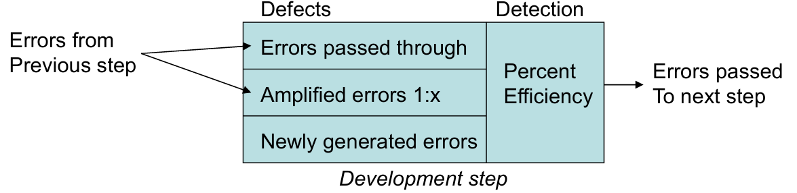

# Chapter 20: Review Techniques

## 20.1 概览

1. **什么是评审？**
    - 由技术人员为技术人员举行的会议。
    - 对软件工程过程中创建的工作产品进行的技术评估。
    - 一种软件质量保证机制（software quality assurance mechanism）。
    - 一个培训场所。
2. **错误（Errors）与缺陷（Defects）**
    - **错误（Error）：** 在软件发布给最终用户之前发现的质量问题。
    - **缺陷（Defect）：** 仅在软件发布给最终用户之后发现的质量问题。
    - 然而，本书中对错误和缺陷所做的时间性区分并不是主流观点。

## 20.2 缺陷放大与消除 Defect Amplification and Removal

1. **缺陷放大模型（Defect Amplification Model）**
    - 该模型描述了在开发步骤中：来自上一步骤的错误、新生成的错误、放大的错误（1:x）以及通过检测后传送到下一步骤的错误。
        
        
        
    - **检测效率：** 决定了有多少百分比的错误能被在该步骤中消除。
2. **成本考量：**
    - 成本指的是在各环节纠正错误的总成本。
    - 假设在设计阶段发现并纠正一个错误需要 1.5 个货币单位。
    - 相对于此成本，若在测试开始前发现同一个错误，成本为 6.5 个单位；在测试期间发现为 15 个单位；发布后发现则在 67 到 100 个单位之间。
    - 多项研究表明，设计活动引入了软件过程中 50% - 65% 的错误。
    - 然而，正式评审技术已被证明在发现设计缺陷方面的有效性高达 75%。
3. **示例：无评审时的缺陷放大**
    
    
    
    - 在初步设计、详细设计到编码/单元测试的过程中，错误被不断放大。
    - 由于没有评审，检测效率较低（0% - 20%）。
    - **总成本计算：** $(10 + 27 \times 3 + 25) \times 20\% \times 6.5 + (94 + 47 + 24) \times 50\% \times 15 + 12 \times 67 = 2177$
4. **示例：有评审时的缺陷放大**
    
    
    
    - 通过在设计阶段引入评审，检测效率显著提高（50% - 70%）。
    - 传送到后续步骤的错误大幅减少。
    - **总成本计算：** $(10 \times 70\% + 28.5 \times 50\%) \times 1.0 + (5 + 10 \times 3 + 25) \times 60\% \times 6.5 + (24 + 12 + 6) \times 50\% \times 15 + 3 \times 67 = 771$

## 20.3 评审度量及其使用 Review Metrics and Their Use

1. **总评审工作量和发现的错误总数定义如下：**
    - $E_{评审} = E_{p} + E_{a} + E_{r}$
    - $Err_{总数} = Err_{次要} + Err_{主要}$
2. **缺陷密度（Defect Density）：** 表示每单位评审工作产品中发现的错误数量。
    - 缺陷密度 $= Err_{总数} / WPS$
3. **各项定义：**
    - **准备工作量（** $E_{p}$ **）：** 在实际评审会议之前，评审工作产品所需的工作量（以人时计）。
    - **评估工作量（** $E_{a}$ **）：** 在实际评审会议期间消耗的工作量。
    - **返工工作量（** $E_{r}$ **）：** 专门用于纠正评审中发现的那些错误的工作量。
    - **工作产品规模（WPS）：** 已评审工作产品规模的度量（例如：UML 模型的数量或文档页数）。
    - **次要错误（** $Err_{次要}$ **）：** 纠正所需工作量少于预先设定值的错误数量。
    - **主要错误（** $Err_{主要}$ **）：** 纠正所需工作量多于预先设定值的错误数量。
4. **评估节省：示例 I**
    - 纠正一个模型次要错误（评审后立即进行）需要 4 个人时。
    - 纠正一个主要需求错误需要 18 个人时。
    - 数据表明，次要错误的发生频率约为主要错误的 6 倍。
    - 因此，评审中发现并纠正需求错误的平均工作量约为 6 个人时。
    - 在测试期间发现并纠正需求相关错误平均需要 45 个人时。
    - **每个错误节省的工作量：** $E_{测试} - E_{评审} = 45 - 6 = 39$ 个人时。
    - 若评审中发现了 22 个需求模型错误，则可节省约 660 个人时的测试工作量。
5. **有无评审时的投入工作量：**
    - 使用评审时，早期投入的工作量会增加，但这种早期投资会带来回报，因为后期的测试和纠正工作量减少了。
    - 有评审的开发完成日期早于无评审的日期。评审不占用时间，反而节省时间。
    
    
    
6. **预测工作表现：示例 II**
    - 如果历史记录表明需求模型的平均缺陷密度为 0.6 个错误/页，而一个新模型长达 32 页：
        - 初步估算表明评审将发现约 19 或 20 个错误。
        - 如果你只发现了 6 个错误，要么说明你在开发方面做得非常好，要么说明评审方法不够彻底。

## 20.4 参考模型 Reference Model

1. **评审的正式程度（Formality）在以下情况下会提高：**
    - 为评审人员明确定义了不同的角色。
    - 对评审进行了充分的计划和准备。
    - 定义了明确的评审结构。
    - 评审人员对所做的任何更正进行后续跟踪。
2. **核心要素：** 计划与准备、会议结构、纠正与验证、个人扮演的角色。

## 20.5 非正式评审 Informal Reviews

1. **非正式评审包括：**
    - 与同事一起对软件工程工作产品进行简单的桌面检查（Desk Check）。
    - 以评审工作产品为目的的临时非正式会议（涉及 2 人以上）。
    - 结对编程（Pair Programming）中面向评审的方面。
2. 结对编程鼓励在创建工作产品（设计或代码）时进行持续评审。其好处是可以立即发现错误，从而提高工作产品质量。

## 20.6 正式技术评审 Formal Technical Reviews, FTR

1. **FTR 的目标是：**
    - 发现软件任何表示形式中在功能、逻辑或实现方面的错误。
    - 验证被评审的软件是否符合其需求。
    - 确保软件是按照预定义标准表示的。
    - 实现以统一方式开发的软件。
    - 使项目更具可管理性。
2. FTR 实际上是一类评审，包括走查（Walkthroughs）和审查（Inspections）。

### 20.6.1 评审会议 The Review Meeting

- 通常应有三到五人参与评审。
- 应进行预先准备，但每个人的工作量不应超过两小时。
- 评审会议的持续时间应少于两小时。
- 焦点集中在工作产品上（例如：需求模型的一部分、详细的组件设计、组件源代码）。

### 20.6.2 参与者 The Players

- 评审组长（Review Leader）
- 生产者（Producer）
- 记录员（Recorder）
- 评审员（Reviewer）
- 标准捍卫者（Standards Bearer / SQA）
- 维护专家（Maintenance Oracle）

### 20.6.3 过程 Process

1. **角色职责：**
    - **生产者：** 开发工作产品的个人；通知项目组长工作产品已完成并需要评审。
    - **评审组长：** 评估产品是否就绪，生成材料副本，并分发给评审员进行预先准备。
    - **评审员：** 花费 1 到 2 小时审查产品并记录笔记，以熟悉工作内容。
    - **记录员：** 书面记录评审期间提出的所有重要问题。
2. **阶段划分：**
    - **准备阶段：** 生产者 -> 评审组长 -> 评审员 -> 问题列表。
    - **执行阶段：** 生产者介绍 -> 评审员提出问题 -> 记录员记录。
    - **跟踪阶段：** 结论、SQA 报告。

### 20.6.4 评审指南 Review Guidelines

- 评审产品，而不是生产者。
- 设定议程并遵守它。
- 限制争论和反驳。
- 阐明问题区域，但不要试图解决注意到的每个问题。
- 做书面记录。
- 限制参与者人数，并坚持预先准备。
- 为每个可能被评审的产品开发检查清单（Checklist）。
- 为 FTR 分配资源并安排时间。
- 对所有评审员进行有意义的培训。
- 评审你早期的评审。

### 20.6.5 样本驱动评审 Sample-Driven Reviews, SDRs

1. SDR 试图量化那些作为全面 FTR 主要目标的工作产品。
2. **具体步骤：**
    - 检查每个软件工作产品 $i$ 的一小部分 $a_i$。
    - 记录在 $a_i$ 中发现的故障数 $f_i$。
    - 通过将 $f_i$ 乘以 $1/a_i$，得出该工作产品内故障总数的粗略估计。
    - 按故障估算总数降序排列工作产品。
    - 将可用的评审资源集中在那些估计故障数最高的工作产品上。