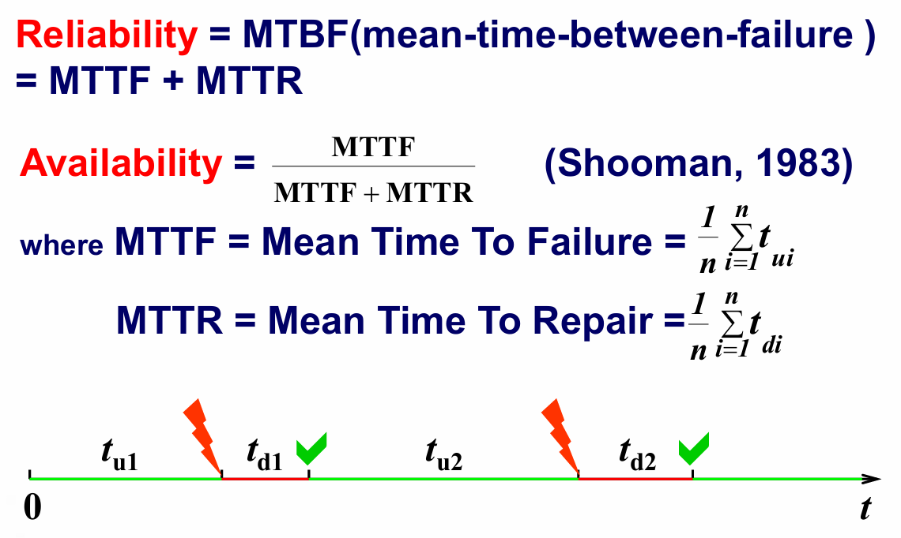

# Chapter 21: Software Quality Assurance

## 21.1 关于质量的评论

菲尔·克劳斯比（Phil Crosby）曾对质量问题发表过以下深刻的见解：

- 质量管理的问题并不在于人们对其一无所知。真正的问题在于人们自以为懂得很多……在这方面，质量和性（Sex）有着惊人的相似之处。
- 每个人都对它表示支持（当然，是在特定的前提条件下）。
- 每个人都自认为非常了解它。（即使他们其实并不想去深入解释它）。
- 每个人都觉得执行起来不过是顺应自然本能罢了（毕竟，我们总归是能应付过去的）。
- 理所当然地，大多数人都觉得这些领域出现的问题都是别人惹的祸。（只要他们肯花点时间把事情做对就好了）。

## 21.2 软件质量保证（SQA）的要素

软件质量保证包含以下关键要素：

- 标准（Standards）
- 审查和审计（Reviews and Audits）
- 测试（Testing）
- 错误/缺陷的收集与分析（Error/Defect Collection and Analysis）
- 变更管理（Charge Management）
- 教育培训（Education）
- 供应商管理（Vendor Management）
- 安全管理（Security Management）
- 安全性（Safety）
- 风险管理（Risk Management）

## 21.3 软件质量保证（SQA）的任务

1. 为项目制定 SQA 计划。
    
    该计划需要明确以下几点：  
    
    - 需要执行的各项评估。
    - 需要执行的审计和审查工作。
    - 适用于当前项目的各项标准。
    - 错误报告与跟踪的具体处理程序。
    - SQA 小组需要产出的相关文档。
    - 向软件项目团队提供的反馈量。
2. 参与项目软件过程描述的开发。   
    - SQA 小组负责审查该过程描述，以确保其完全符合组织的政策、内部软件规范标准、外部强制性标准（例如 ISO-9001）以及软件项目计划中的其他内容要求。
3. 审查软件工程活动，以验证其是否符合既定的软件过程。 
    - 负责识别、记录并跟踪偏离既定过程的情况，同时验证这些偏差是否已被纠正。
4. 审计指定的软件工作产品，以验证其是否符合软件过程的定义规范。 
    - 仔细审查选定的工作产品；识别、记录并跟踪其中的偏差；验证是否已经采取了相应的纠正措施。
    - 定期向项目经理汇报 SQA 的工作结果。
5. 确保软件工作以及工作产品中出现的偏差都能得到妥善记录，并严格按照文件规定的程序进行处理。 
6. 记录所有不合规的情况，并直接向高级管理层汇报。 
    - 所有不合规的项目（Noncompliance Items）都将被持续跟踪，直到问题得到彻底解决。

## 21.4 软件质量保证（SQA）的目标

- **需求质量：** 需求模型的正确性、完整性和一致性，将直接且强烈地影响后续所有软件工作产品的最终质量。
- **设计质量：** 软件团队必须对设计模型的每一个元素进行全面评估，确保其具备高质量属性，且设计本身完全贴合最初的需求规格。
- **代码质量：** 源代码及相关的辅助工作产品（如其他描述性信息）必须严格遵循当地的编码规范，并具备易于后期维护的良好特性。
- **质量控制的有效性：** 软件开发团队应当将有限的资源运用在最有可能产生高质量结果的地方，以实现资源的效益最大化。

## 21.5 正规软件质量保证 Formal SQA

- 这种方法建立在一个基本假设之上：即可以为现有的每一种编程语言定义出极其严格的语法和语义规则。
- 它允许我们在软件需求的规范化定义方面采用严谨和科学的方法。
- 运用数学证明的正确性验证技术，来科学地论证一个程序是否完全符合其预定的规范要求。

## 21.6 统计软件质量保证 Statistical SQA

1. 关于产品与过程的统计测量，是对“如何提升质量”的一种深入理解。 具体步骤如下：
    - 收集关于所有缺陷的详细信息。
    - 找出导致这些缺陷的根本原因。
    - 采取实际行动为整个流程提供修复方案。
    - 将收集到的关于软件错误和缺陷的信息进行科学分类。
    - 尽力追溯每一个错误和缺陷的潜在根源（原因可能包括：未遵守规范、设计存在缺陷、违反标准流程、与客户沟通不到位等）。
    - 运用帕累托原则（即 80% 的缺陷往往源于 20% 的原因），精准隔离出那 20% 最为“关键少数”原因。
    - 一旦确定了这些“关键少数”，就立即采取行动，从根本上纠正这些导致错误和缺陷的问题。
2. **软件工程的 6-Sigma 原则**
    - “六西格玛”这个术语来源于统计学中的六个标准差——这意味着在每百万次发生中仅允许出现 3.4 个实例（缺陷），代表了一种极其严苛的高质量标准。
    - 六西格玛方法论定义了以下三个核心步骤：
        - Define：通过结构化和清晰的客户沟通方法，精准定义客户需求、交付成果以及项目目标。
        - Measure：对现有的过程及其输出结果进行测量，以评估当前的质量表现（即收集缺陷相关的指标数据）。
        - Analyze：分析缺陷指标数据，从而确定“关键的少数”致错原因。
        - Improve：通过彻底消除这些缺陷的根本原因，来优化和改进现有过程。
        - Control：对过程实施严格控制，以确保在未来的工作环节中不会再次引入导致缺陷的同类原因。

## 21.7 软件可靠性与安全性

1. **软件可靠性 Software Reliability**
    
    
    
2. **软件安全性 Software Safety**
    - 软件安全性是一项至关重要的软件质量保证活动。它的主要焦点在于识别和评估那些可能会对软件产生负面影响，并最终导致整个系统发生严重故障的潜在危险（Hazards）。
    - 如果我们能够在软件生命周期的早期阶段就准确识别出这些危险，我们就可以针对性地指定相应的软件设计特征，从而彻底消除或有效控制这些潜在的危险。

## 21.8 ISO 9001:2008 标准

- ISO 9001:2008 是目前广泛应用于软件工程领域的权威质量保证标准。
- 该标准明确规定了构建一个行之有效的质量保证体系所必须满足的 20 项核心要求。
- ISO 9001:2008 所勾勒的具体要求涵盖了以下诸多关键主题：
    - 管理层的责任划分、质量体系的构建、合同条款的评审、产品设计控制、相关文档和数据的管理控制、产品标识与整个生命周期的可追溯性、过程运作控制、检验与测试流程、纠正与预防措施的实施、质量记录的管理控制、内部的质量审计、人员培训、后续服务支持，以及统计技术的合理应用。