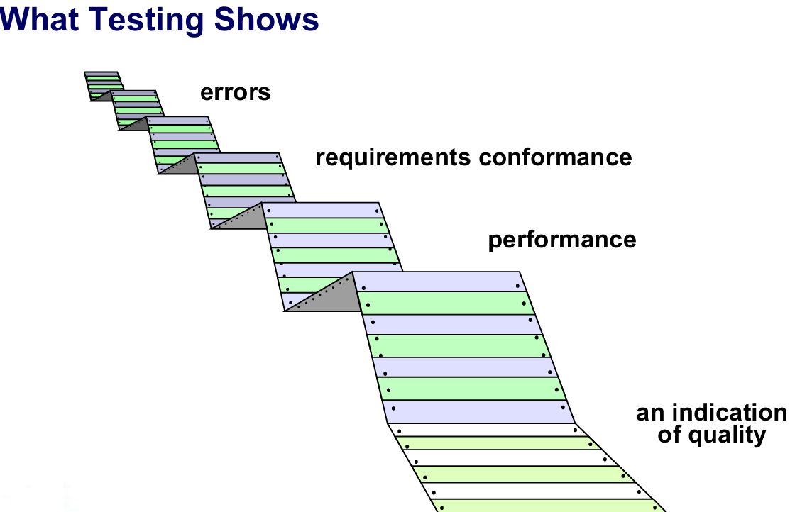

# Chapter 22: Software Testing Strategies

## 22.1 软件测试基础概念

1. **软件测试** ：测试是在交付给最终用户之前，以发现错误为特定目的而执行程序的过程 。
2. **软件测试所能展示的内容**
    
    
    
    - 错误的存在 。
    - 软件的需求符合性 。
    - 系统的性能表现 。
    - 对产品质量的一种指示 。
3. **战略方法论**
    - 为了进行有效的测试，应该进行有效的技术审查。通过这种做法，许多错误将在测试开始前被消除 。
    - 测试从组件级别开始，并向外层“扩展”至整个基于计算机系统的集成 。
    - 不同的测试技术适用于不同的软件工程方法以及不同的时间点 。
    - 测试由软件开发人员以及（对于大型项目而言）独立的测试团队进行 。
    - 测试和调试是不同的活动，但调试必须被纳入任何测试策略中 。
4. **验证与确认 V & V（Verification and Validation）**
    - **验证（Verification）**：指的是确保软件正确实现特定功能的一组任务 。
    - **确认（Validation）**：指的是确保所构建的软件可以追溯到客户需求的一组任务 。
    
    <aside>
    💡
    
    Boehm 用另一种方式表述了这一点 ：
    
    - 验证：“我们是在正确地构建产品吗？”
    - 确认：“我们是在构建正确的产品吗？”
    </aside>
    
5. **测试角色：谁来测试软件？**
    - **开发人员（Developer）** ：了解系统，但是会“温和地”进行测试，并且受到交付的驱动 。
    - **独立测试人员（Independent tester）** ：必须学习并了解系统，但是会试图打破（破坏）它，并且受到质量的驱动 。

## 22.2 测试策略与演进流程

1. **测试策略概览**
    - **整体流程** ：系统工程 -> 分析建模 -> 设计建模 -> 代码生成 。
    - 对应测试：单元测试、集成测试、确认测试、系统测试 。
    
    
    
2. **从小规模测试向大规模测试演进**
    
    **测试演进**：我们从“小型测试（testing-in-the-small）”开始，逐步转向“大型测试（testing-in-the-large）” 。
    
    - **对于传统软件**：最初的焦点是模块（组件），随后是模块的集成 。
    - **对于面向对象（OO）软件**：当我们进行“小型测试”时，我们的焦点从单个模块（传统观点）转变为包含属性和操作、并涉及通信和协作的面向对象类 。
3. **战略性问题与原则**
    - 在测试开始之前很久，就以可量化的方式详细说明产品需求 。
    - 明确说明测试目标 。
    - 了解软件的用户，并为每个用户类别开发一份概况 。
    - 制定强调“快速循环测试”的测试计划。构建旨在进行自我测试的“健壮”软件 。
    - 在测试之前，使用有效的技术审查作为过滤器。进行技术审查以评估测试策略和测试用例本身 。
    - 为测试过程开发持续改进的方法 。

## 22.3 具体测试阶段与方法

1. **单元测试（Unit Testing）**
    - **单元测试流程** ：软件工程师将测试用例应用于待测试模块，从而得出测试结果 。
        
        
        
    - **待测试模块内容** ：接口、局部数据结构、边界条件、独立路径、错误处理路径 。
    - **单元测试环境结构：**
        - 使用驱动程序（driver）和桩程序（stub）来辅助测试模块（Module） 。
        - 测试用例作用于测试接口、局部数据结构、边界条件、独立路径和错误处理路径，最终生成结果。
2. **集成测试策略（Integration Testing）**
    - **策略选项** ：“大爆炸（big bang）”方法与增量构建策略（Incremental Construction Strategy）
    - **自顶向下集成（Top Down Integration）** ：
        - 顶部模块使用桩程序（stubs）进行测试 。
        - 一次替换一个桩程序，采用“深度优先（depth first）”策略 。
        - 随着新模块的集成，重新运行部分测试集 。
        
        
        
    - **自底向上集成（Bottom-Up Integration）** ：
        - 一次替换一个驱动程序（drivers），采用“深度优先”策略 。
        - 工作模块（worker modules）被分组到构建块（builds）中并进行集成（形成集群 cluster） 。
        
        
        
    - **三明治测试（Sandwich Testing）** ：
        - 这是一种混合策略：顶部模块使用桩程序进行测试 。
        - 同时，底部的工作模块被分组到构建块中并进行集成（集群） 。
        
        
        
3. **回归测试（Regression Testing）**
    - 回归测试是重新执行已经进行过的某些测试子集，以确保更改没有传播意外的副作用 。
    - 每当软件被修正时，软件配置（程序、文档或支持它的数据）的某些方面就会发生改变 。
    - 回归测试有助于确保更改（由于测试或其他原因）不会引入意外的行为或额外的错误 。
    - 可以通过手动重新执行所有测试用例的子集来进行，或者使用自动化的捕获/回放工具 。
4. **冒烟测试（Smoke Testing）**
    - 这是为产品软件创建“每日构建（daily builds）”的常见方法 。
    - **步骤**：
        1. 已转换为代码的软件组件被集成到一个“构建（build）”中 。构建包括实现一个或多个产品功能所需的所有数据文件、库、可重用模块和工程化组件 。
        2. 设计一系列测试来暴露会阻碍构建（build）正确执行其功能的错误 。目的应该是发现“致命错误（show stopper errors）”，这些错误极有可能导致软件项目进度落后 。
        3. 该构建与其他构建集成（集成方法可以是自顶向下或自底向上的 ），并且每天对整个产品（以其当前形式）进行冒烟测试 。

## 22.4 针对特定领域的测试标准与策略

1. **通用测试准则**
    - **接口完整性（Interface integrity）**：在将每个模块或集群添加到软件中时，测试内部和外部的模块接口 。
    - **功能有效性（Functional validity）**：测试以发现软件中的功能缺陷 。
    - **信息内容（Information content）**：测试局部或全局数据结构中的错误 。
    - **性能（Performance）**：验证是否测试了特定的性能边界 。
2. **面向对象（OO）测试**
    - **策略概述** ：从评估分析和设计模型的正确性和一致性开始 。
    - **测试策略的变化：**
        - 由于封装，“单元”的概念变宽了 。
        - 集成集中在类及其跨“线程”或在特定使用场景上下文中的执行 。
        - 验证采用传统的黑盒方法 。
        - 测试用例设计借鉴了传统方法，但也包含特殊功能 。
    - **拓宽“测试”的视野：**
        - 核心观点 ：可以认为审查面向对象（OO）分析和设计模型特别有用，因为相同的语义结构（例如类、属性、操作、消息）出现在分析、设计和代码级别 。
        - 因此，在分析阶段发现类属性定义中的问题，将有助于规避如果在设计或代码阶段（甚至下一次分析迭代）才发现该问题可能产生的副作用 。
    - **CRC 模型测试步骤** ：
        1. 重新审视 CRC 模型和对象关系模型 。
        2. 检查每个 CRC 索引卡的描述，以确定委托责任是否是协作者定义的一部分 。
        3. 反转连接，以确保每个被要求提供服务的协作者都能从合理的来源接收请求 。
        4. 使用步骤3中检查的反转连接，确定是否需要其他类，或者责任是否在类之间合理分组 。
        5. 确定广泛请求的职责是否可以合并为单一职责 。
        6. 步骤1至5将迭代应用于每个类以及分析模型的每次演进中 。
    - **面向对象（OO）测试策略：**
        - 类测试等同于单元测试。测试类中的操作，并检查类的状态行为 。
        - 集成应用了三种不同的策略 ：
            - 基于线程的测试：集成响应一个输入或事件所需的类集合 。
            - 基于用例的测试：集成响应一个用例所需的类集合 。
            - 集群测试：集成证明一个协作所需的类集合 。
3. **WebApp 测试**
    - 审查 WebApp 的内容模型以发现错误 。
    - 审查接口模型以确保能够容纳所有用例 。
    - 审查 WebApp 的设计模型以发现导航错误 。
    - 测试用户界面以发现表示和/或导航机制中的错误 。
    - 对每个功能组件进行单元测试 。
    - 测试整个架构中的导航 。
    - 在各种不同的环境配置中实现 WebApp，并测试与每种配置的兼容性 。
    - 进行安全测试以尝试利用 WebApp 或其环境中的漏洞 。
    - 进行性能测试 。
    - 由受控且受监控的最终用户群体对 WebApp 进行测试 。评估他们与系统交互的结果，以了解内容和导航错误、可用性问题、兼容性问题以及 WebApp 的可靠性和性能 。
4. **MobileApp 测试**
    - **用户体验测试**：确保应用程序满足利益相关者对可用性和可访问性的期望 。
    - **设备兼容性测试**：在多台设备上进行测试 。
    - **性能测试**：测试非功能性需求 。
    - **连通性测试**：测试应用程序可靠连接的能力 。
    - **安全测试**：确保应用程序满足利益相关者的安全期望 。
    - **野外测试（Testing-in-the-wild）**：在实际用户环境中的用户设备上测试应用程序 。
    - **认证测试**：确保应用程序符合分发标准 。
5. **高阶测试（High Order Testing）**
    - **确认测试（Validation testing）**：焦点在软件需求上 。
    - **系统测试（System testing）**：焦点在系统集成上 。
    - **Alpha/Beta 测试**：焦点在客户使用情况上 。
    - **恢复测试（Recovery testing）**：迫使软件以各种方式失效，并验证是否正确执行了恢复 。
    - **安全测试（Security testing）**：验证系统内置的保护机制是否确实能保护其免受不当渗透 。
    - **压力测试（Stress testing）**：以要求异常数量、频率或体积资源的方式执行系统 。
    - **性能测试（Performance Testing）**：在集成系统的上下文中测试软件的运行时性能 。

## 22.5 调试与纠错过程

1. **调试过程（The Debugging Process）**
    - 执行测试用例（Test Cases）得出结果（Results） 。
    - 通过调试（Debugging）推断出疑似原因（Suspected causes）或确定原因（Identified causes） 。
    - 进行纠正（Corrections）后，进行回归测试（Regression Tests）或额外的测试（Additional tests）以确保问题被修复 。
    - 调试工作量 = 诊断症状并确定原因所需的时间 + 纠正错误和进行回归测试所需的时间 。
2. **症状和原因的关系** ：
    - 症状（symptom）和原因（cause）在地理位置上可能是分离的 。
    - 当修复另一个问题时，症状可能会消失 。
    - 原因可能是由于非错误的组合导致的 。
    - 原因可能是由于系统或编译器错误引起的 。
    - 原因可能是由于每个人都相信的假设引起的 。
    - 症状可能是间歇性的 。
3. **缺陷的后果与类别**
    - **缺陷后果等级（从轻到重）** ：轻微（mild）、恼人（annoying）、令人不安（disturbing）、严重（serious）、极端（extreme）、灾难性（catastrophic）、传染性（infectious） 。
        
        
        
    - **缺陷类别（Bug Categories）**：功能相关缺陷、系统相关缺陷、数据缺陷、编码缺陷、设计缺陷、文档缺陷、标准违规等 。
4. **调试技术与错误纠正**
    - **常用调试技术** ：
        - 蛮力法/测试（brute force / testing）。
        - 回溯法（backtracking）。
        - 归纳法（induction）。
        - 演绎法（deduction）。
    - **在纠正错误时需要思考的问题** ：
        - **该缺陷的原因是否在程序的另一部分再现？** 在许多情况下，程序缺陷是由可能在别处重现的错误逻辑模式引起的 。
        - **我要做的修复可能会引入什么“下一个缺陷”？** 在进行更正之前，应评估源代码（或者最好是设计），以评估逻辑和数据结构的耦合 。
        - **我们一开始可以做些什么来防止这个缺陷？** 这是建立统计软件质量保证方法的第一步。如果您不仅纠正了产品，还纠正了过程，那么该缺陷将从当前程序中移除，并且可能从所有未来的程序中消除 。