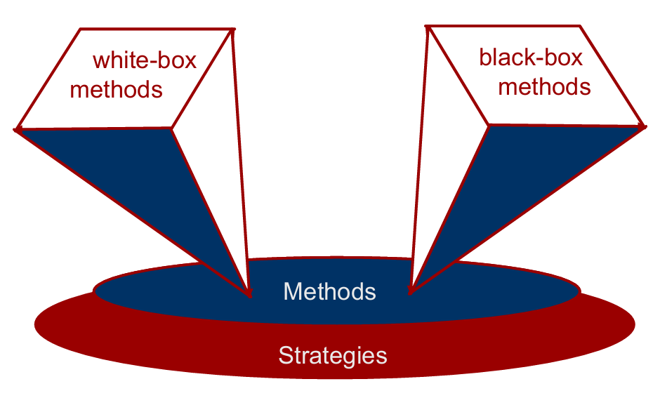

# Chapter 23: Testing Conventional Applications

## 23.1 测试基础与测试性概论

1. 测试性（Testability）包含了以下几个属性：
    - 可操作性（Operability）——它运行清晰干净 。
    - 可观察性（Observability）——每个测试用例的结果都容易观察到 。
    - 可控性（Controllability）——测试可以被自动化和优化的程度 。
    - 可分解性（Decomposability）——测试可以具有针对性 。
    - 简单性（Simplicity）——减少复杂的架构和逻辑以简化测试 。
    - 稳定性（Stability）——在测试期间很少要求变更 。
    - 设计的可理解性（Understandability of the design） 。
2. 什么是“好”的测试？
    - 一个好的测试有很高的概率发现错误 。
    - 一个好的测试不是冗余的 。
    - 一个好的测试应该是“同类中最好的”（best of breed） 。
    - 一个好的测试应该既不太简单也不太复杂 。
3. 穷举测试（Exhaustive Testing）所需的成本太高，故使用选择性测试（Selective Testing）。选择性测试是建立在测试用例的基础上的。
4. 测试用例的设计原则
    - 目标（Objective）：以发现错误为目的 。
    - 标准（Criteria）：以完整的方式进行 。
    - 约束（Constraint）：用最少的工作量和时间 。
5. 软件测试的主要方法
    - 白盒方法（white-box methods）
    - 黑盒方法（black-box methods）
    
    
    
    <aside>
    💡
    
    **内部和外部视图（Internal & External Views）**
    
    任何工程产品（以及大多数其他事物）都可以通过以下两种方式之一进行测试：
    
    - 了解产品设计要执行的特定功能，可以进行测试以证明每个功能都完全运行，同时寻找每个功能中的错误（即黑盒测试） 。
    - 了解产品的内部工作原理，可以进行测试以确保“所有齿轮啮合”，即内部操作根据规格执行，并且所有内部组件都得到了充分的行使（即白盒测试） 。
    </aside>
    

## 23.2 白盒测试技术 White-Box Methods

1. **测试目标与依据**
    - **核心目标**：确保程序中的所有语句和逻辑条件至少被执行一次 。
    - **为什么要追求全覆盖？**
        - 逻辑错误和不正确的假设往往与某条路径的执行概率成反比 。
        - 开发人员通常会主观地认为某些路径不太可能被执行，但现实情况往往与直觉相反 。
        - 错误是随机发生的，那些未经测试的路径中很可能就潜伏着这类错误 。
2. **基本路径测试（Basis Path Testing）**
    - 这是一种通过计算流图的“圈复杂度（cyclomatic complexity）”来推导独立测试路径的方法 。
    - 圈复杂度的计算方式为“封闭区域的数量 + 1” 。行业研究表明，圈复杂度越高的模块，其出错的概率也越高 。
    - 圈复杂度也可用“简单判定节点的数量 + 1” 计算。一个包含两个简单条件的复合判定等价于 **2** 个简单的判定节点。
        
        
        
    - 测试人员需要确定线性独立路径的基本集合，并准备测试用例来强制执行这些路径 。
        
        
        
    - 在这个过程中，带有链接权重的**图矩阵（Graph Matrices）**可以作为评估程序控制结构的强大工具 。
        - 图矩阵的行列数与流程图中的节点数相同。
        - 每一行和每一列对应一个节点，矩阵条目对应于节点之间的连接（边） 。
        - 通过为每个矩阵条目添加链接权重，图矩阵可以成为在测试期间评估程序控制结构的强大工具 。
3. **控制结构测试（Control Structure Testing）**
    - **条件测试（Condition Testing）**：用于行使程序模块中包含的逻辑条件 。
    - **数据流测试（Data Flow Testing）**：根据程序中变量被“定义（DEF）”和被“使用（USE）”的位置来选择测试路径，用于验证变量从“被定义”到“被使用”的这条链路是否畅通且正确。过程如下：
        - 假设程序中的每个语句都被分配了一个唯一的语句编号，并且每个函数不修改其参数或全局变量 。
        - 对于语句编号为 S 的语句：
            - $DEF(S)=\{X| 语句S包含X的定义\}$
            - $USE(S)=\{X| 语句S包含X的使用\}$
        - 变量 X 的定义-使用（DU）链的形式为 $[X, S, S']$，其中 S 和 S' 分别是包含了 X 的定义和使用的语句编号，即变量 X 必须存在于 $DEF(S)$ 中，并且存在于 $USE(S')$ 中。
        - 验证变量 X 的定义-使用（DU）链是否畅通且正确。
4. **循环测试（Loop Testing）**
    
    
    
    - 针对不同代码结构的循环进行测试，包括简单循环、嵌套循环、串联循环和非结构化循环 。
    - **简单循环的最小测试：**
        1. 完全跳过循环 。  
        2. 只通过循环一次 。  
        3. 通过循环两次 。  
        4. 通过循环 m 次，其中 m<n ，n 为循环允许的最大通过次数。 
        5. 通过循环 (n-1)、n 和 (n+1) 次 。  
    - **嵌套循环的测试：**
        1. 从最内层循环开始。将所有外层循环设置为其最小迭代参数值 。
        2. 测试最内层循环的 min+1、典型值、max-1 和 max，同时将外层循环保持在最小值 。
        3. 向外移动一层循环并如步骤 2 一样进行设置，将所有其他循环保持为典型值 。
        4. 继续此步骤，直到测试完最外层循环 。
    - **串联循环的测试：**
        
        如果循环彼此独立，那么将每个循环视为简单循环。否则将其视为嵌套循环 。
        

## 23.3 黑盒测试技术 Black-Box Methods

1. **黑盒测试需要回答的问题** 
    - 如何测试功能有效性？
    - 如何测试系统行为和性能？
    - 哪些类别的输入将构成好的测试用例？
    - 系统是否对某些特定的输入值特别敏感？
    - 如何隔离数据类的边界？
    - 系统能容忍什么样的数据速率和数据量？
    - 特定数据组合对系统运行有什么影响？
2. **基于图的方法（Graph-Based Methods）**
    
    
    
    - 这种方法旨在理解软件中建模的“对象”（object #1, object #2, object #3）以及连接这些对象的“关系” 。
    - 这里的“对象”是一个广义概念，涵盖了数据对象、传统组件（模块）以及面向对象软件中的元素 。
3. **等价划分（Equivalence Partitioning）**
    
    
    
    - 将输入域和交互（如用户查询、鼠标点击、输出格式等）划分为不同的等价类，通过分类提取代表性数据，从而获得更好、更高效的测试用例。
    - **有效数据类（Valid Data）**包括：用户提供的命令、系统提示响应、文件名、物理参数、边界值等 。
    - **无效数据类（Invalid Data）**包括：超出程序边界的数据、物理上不可能的数据、以及在错误位置提供的适当值 。
4. **边界值分析（Boundary Value Analysis）**
    
    
    
    - 这是等价划分的补充，重点关注输入域和输出域的边界地带进行测试，因为很多错误往往发生在边界情况处理上 。
5. **比较测试（Comparison Testing）**
    - 仅用于软件可靠性绝对关键的情况（例如，载人系统） 。
    - 在开发环节，不同的软件工程团队使用相同的规范开发应用程序的独立版本 。
    - 在测试环节。使用相同的测试数据测试每个版本，以确保所有版本都提供相同的输出 。
    - 在执行环节，所有版本都并行执行，并实时比较结果以确保一致性 。
6. **正交阵列测试（Orthogonal Array Testing）**
    
    
    
    - 当输入参数的数量较少，并且每个参数可以采用的值有明确边界时使用 。
    - 测试基于变量维度（如X、Y、Z轴上的点），每次输入一项进行测试 。
7. **基于模型的测试（Model-Based Testing）**
    1. 分析软件的现有行为模型或创建一个行为模型 。
    2. 回想一下，行为模型指示了软件将如何响应外部事件或刺激 。
    3. 遍历行为模型并指定将迫使软件进行从一个状态到另一个状态转换的输入 。
    4. 输入将触发导致转换发生的事件 。
    5. 回顾行为模型并记录下软件从一个状态转换到另一个状态时的预期输出 。
    6. 执行测试用例 。
    7. 比较实际结果和预期结果，并在需要时采取纠正措施 。
8. **软件测试模式（Software Testing Patterns）**
    
    示例： 
    
    - 模式名称：场景测试（ScenarioTesting） 。
    - 摘要：执行单元和集成测试后，需要确定软件的执行方式是否能满足用户 。
    - 场景测试（ScenarioTesting）模式描述了一种从用户的角度行使软件的技术 。
    - 这一级别的失败表明软件未能满足用户可见的需求。