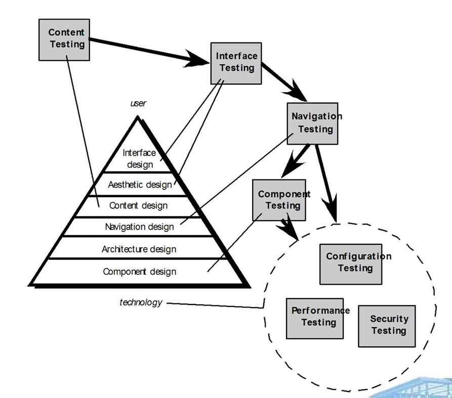

# Chapter 25: Testing Web Applications

## 25.1 Web 应用程序质量维度

### 25.1.1 测试质量维度

- **内容（Content）：**需在句法（Syntactic）和语义（Semantic）两个层面上进行评估 。
    - **句法层面**：对于基于文本文档，需要对拼写、标点符号和语法进行评估 。
    - **语义层面**：需要评估信息的正确性、整个内容对象及相关对象之间的一致性，以及是否不存在歧义 。
- **功能（Function）**：需要测试其正确性、不稳定性，以及对适当的实施标准（例如，Java 或 XML 语言标准）的总体符合性 。
- **结构（Structure）**：进行评估以确保其能正确传递 WebApp 的内容，并且功能具有可扩展性，同时确保在添加新内容或新功能时系统能够提供支持 。
- **可用性（Usability）**：进行测试以确保每一类用户都能得到界面的支持 。用户能够学习并应用所有必需的导航语法和语义 。
- **可导航性（Navigability）**：进行测试以确保运用所有的导航语法和语义，从而发现任何导航错误（例如，死链接、不恰当的链接、错误的链接） 。
- **性能（Performance）**：在各种操作条件、配置和负载下进行测试，以确保系统对用户交互具有良好的响应性 。系统能够处理极端负载，而不会出现不可接受的运行性能下降 。
- **兼容性（Compatibility）**：通过在客户端和服务器端的各种不同主机配置中执行 WebApp 来进行测试 。其目的是发现特定于某个独特主机配置的错误 。
- **互操作性（Interoperability）**：进行测试以确保 WebApp 能与其他应用程序和（或）数据库进行正确的交互 。
- **安全性（Security）**：通过评估潜在漏洞并尝试利用每个漏洞来进行测试 。任何成功的渗透尝试都被视为安全失败 。

### 25.1.2 WebApp 测试策略

- 审查 WebApp 的内容模型以发现错误 。
- 审查界面模型以确保能够容纳所有用例 。
- 审查 WebApp 的设计模型以发现导航错误 。
- 测试用户界面以发现展示和（或）导航机制中的错误 。
- 对选定的功能组件进行单元测试 。
- 测试整个架构的导航 。
- 将 WebApp 在各种不同的环境配置中实现，并测试其与每种配置的兼容性 。
- 进行安全测试，试图利用 WebApp 或其环境中的漏洞 。
- 进行性能测试 。
- WebApp 由受控和受监控的最终用户群体进行测试 。
- 评估用户与系统交互的结果，以检查内容和导航错误、可用性问题、兼容性问题，以及 WebApp 的可靠性和性能 。

## 25.2 测试过程

测试过程与设计层次紧密相关，呈现出一种金字塔结构。

- **设计层次（从上到下）**：用户层 、界面设计 、美学设计 、内容设计 、导航设计 、架构设计 、组件设计 ，以及底层的技术层 。
- **对应的测试类型**：内容测试 、界面测试 、导航测试 、组件测试 。
- **系统级测试**：在技术基础架构上，还需要进行配置测试 、性能测试 和安全测试

## 25.3 具体测试领域

### 25.3.1 内容测试 Content Testing

1. **内容测试有三个重要目标 ：**
    - 发现基于文本文档、图形表示和其他媒体中的句法错误（例如，错别字、语法错误） 。
    - 发现导航发生时呈现的任何内容对象中的语义错误（即信息准确性或完整性方面的错误） 。
    - 发现呈现给最终用户的内容在组织或结构上的错误 。
2. **评估内容语义的问题清单** ：
    - 信息在事实上准确吗？
    - 信息是否简明扼要？
    - 内容对象的布局是否易于用户理解？
    - 是否容易找到嵌入在内容对象中的信息？
    - 是否为源自其他来源的所有信息提供了适当的参考文献？
    - 呈现的信息是否内部一致，并与其他内容对象中呈现的信息相一致？
    - 内容是否具有冒犯性、误导性，或者是否会引发诉讼？
    - 内容是否侵犯了现有的版权或商标？内容是否包含补充现有内容的内部链接？
    - 这些链接正确吗？
    - 内容的美学风格是否与界面的美学风格相冲突？

### 25.3.2 数据库测试 Database Testing

测试是在各个层级上被定义的：

- **客户端层用户界面**：涉及 HTML 脚本和用户数据 。
- **服务器层（WebApp）** ：
    - 服务器层数据转换：涉及用户数据和 SQL 。
    - 服务器层数据管理：涉及原始数据和 SQL 。
- **数据库层**：数据访问与数据库本身 。

### 25.3.3 界面相关测试 User Interface Testing

1. **用户界面测试** 
    - 测试界面功能以确保设计规则、美学和相关的视觉内容可供用户无误地使用 。
    - 以类似于单元测试的方式，单独测试各个界面机制 。
    - 在针对特定用户类别的用例或导航语义单元（NSU）的上下文中测试每个界面机制 。
    - 针对选定的用例和NSU测试整个界面，以发现界面语义中的错误 。
    - 在各种环境（例如不同浏览器）中测试界面，以确保其兼容性 。
2. **测试界面机制**
    - **链接**：将用户链接到其他某些内容对象或功能的导航机制 。
    - **表单**：包含由用户填写的空白字段的结构化文档 。字段中包含的数据用作一个或多个 WebApp 功能的输入 。
    - **客户端脚本**：脚本语言（例如 Javascript）中编程命令的列表，用于处理通过表单或其他用户交互输入的信息 。
    - **动态 HTML**：引导产生在客户端使用脚本或层叠样式表（CSS）操作的内容对象 。
    - **客户端弹出窗口**：在没有用户交互的情况下弹出的小窗口 。这些窗口可以是面向内容的，并且可能需要某种形式的用户交互 。
    - **CGI 脚本**：通用网关接口（CGI）脚本实现了一种标准方法，允许 Web 服务器与用户进行动态交互（例如，一旦用户提交表单，WebApp 就可以使用 CGI 脚本来处理表单中的数据） 。
    - **流媒体内容**：内容对象从服务器端自动下载，而不是等待来自客户端的请求 。这种方法有时被称为“推送”技术，因为是由服务器将数据推送到客户端 。
    - **Cookie**：由于特定的用户交互，由服务器发送并由浏览器存储的数据块 。数据的内容是特定于 WebApp 的（例如，用户标识数据或用户已选择购买的商品列表） 。
    - **特定于应用程序的界面机制**：包含一个或多个“宏”界面机制，如购物车、信用卡处理或运费计算器 。

### 25.3.4 可用性测试 Usability Testing

1. 由 Web 工程团队设计测试，并由最终用户执行 。
2. **测试流程：**
    - 定义一组可用性测试类别，并确定每个类别的目标 。
    - 设计能够评估每个目标的测试用例 。
    - 选择将要执行测试的参与者 。
    - 在进行测试时，记录并检测参与者与 WebApp 的交互 。
    - 开发一种评估 WebApp 可用性的机制 。
3. **不同抽象级别的评估** ：
    - 可以评估特定界面机制（例如表单）的可用性 。
    - 可以评估完整网页（包含界面机制、数据对象和相关功能）的可用性 。
    - 可以评估完整WebApp的可用性 。

### 25.3.5 兼容性测试 Compatibility Testing

- 兼容性测试的目的是定义一组“常见”的客户端计算配置及其变体 。
- 创建一个树形结构来标识以下信息 ：
    - 每个计算平台 。
    - 典型的显示设备 。
    - 该平台支持的操作系统 。
    - 可用的浏览器 。
    - 可能的互联网连接速度及类似信息 。
- 推导出一系列兼容性验证测试 ，这些测试源自现有的界面测试、导航测试、性能测试和安全测试 。
- 这些测试的意图是发现可追溯到配置差异的错误或执行问题 。

### 25.3.5 组件级测试 Component-Level Testing

- 侧重于一组试图发现 WebApp 功能中错误的测试 。
- 可以使用传统的黑盒和白盒测试用例设计方法 。
- 数据库测试通常是组件测试体系中不可或缺的一部分 。

### 25.3.6 导航测试 Navigation Testing

应测试以下导航机制 ：

- **导航链接**：包括 WebApp 内的内部链接、指向其他 WebApp 的外部链接，以及特定网页内的锚点 。
- **重定向**：当用户请求不存在的 URL，或选择目标已被删除或名称已更改的链接时，起作用的链接机制 。
- **书签**：虽然书签是浏览器功能，但也应测试 WebApp 以确保在创建书签时可以提取有意义的页面标题 。
- **框架和框架集**：测试其内容是否正确、布局和尺寸是否合适、下载性能以及浏览器兼容性 。
- **站点地图**：应测试每个站点地图条目，以确保链接将用户带到正确的内容或功能 。
- **内部搜索引擎**：验证搜索的准确性和完整性、搜索引擎的错误处理属性以及高级搜索功能 。

### 25.3.7 配置测试 Configuration Testing

1. 配置测试（服务器端） 
    - WebApp 是否与服务器操作系统完全兼容？当 WebApp 运行时，系统文件、目录和相关系统数据是否被正确创建？
    - 系统安全措施（例如防火墙或加密）是否允许 WebApp 执行并为用户提供服务，而不会产生干扰或性能下降？
    - WebApp 是否已在所选的分布式服务器配置（如果存在）下进行了测试？
    - WebApp 是否与数据库软件正确集成？WebApp 对不同版本的数据库软件是否敏感？
    - 服务器端 WebApp 脚本执行是否正常？
    - 是否检查了系统管理员错误对其 WebApp 操作的影响？
    - 如果使用了代理服务器，是否通过现场测试解决了它们在配置上的差异？
2. 配置测试（客户端） 
    
    需要考虑以下变体，并将配置变量的数量减少到可管理的范围内 ：
    
    - **硬件**：CPU、内存、存储和打印设备 。
    - **操作系统**：Linux、Macintosh OS、Microsoft Windows，以及移动操作系统 。
    - **浏览器软件**：Internet Explorer、Mozilla/Netscape、Opera、Safari及其他 。
    - **用户界面组件**：Active X、Java applets及其他 。
    - **插件**：QuickTime、RealPlayer及许多其他插件 。
    - **连接性**：有线网络、DSL、普通调制解调器、T1 。

### 25.3.8 安全测试 Security Testing

- 旨在探测客户端环境、数据在客户端和服务器之间来回传递时发生的网络通信，以及服务器端环境的漏洞 。
- 在客户端，漏洞通常可以追溯到浏览器、电子邮件程序或通信软件中预先存在的错误 。
- 在服务器端，漏洞包括拒绝服务攻击和恶意脚本，这些脚本可以传递给客户端或用于使服务器操作瘫痪 。

## 25.4 性能与系统级测试

### 25.4.1 性能测试 Performance Testing

- 服务器响应时间是否下降到明显且不可接受的程度？
- 在什么情况下（就用户、事务或数据加载而言），性能会变得不可接受？
- 哪些系统组件应对性能下降负责？
- 在各种负载条件下，用户的平均响应时间是多少？
- 性能下降是否会对系统安全性产生影响？
- 随着系统负载的增加，WebApp 的可靠性或准确性是否受到影响？
- 当施加的负载大于服务器最大容量时会发生什么？

### 25.4.2 负载测试 Load Testing

- 负载测试的意图是确定 WebApp 及其服务器端环境将如何响应各种负载条件 。
- 参数定义：
    - N：并发用户数
    - T：每单位时间的在线事务数
    - D：服务器每个事务处理的数据负载
- 总吞吐量P的计算方式如下： $P=N\times T\times D$ 。

### 25.4.3 压力测试 Stress Testing

- 当超出容量时，系统是“平稳地”降级，还是服务器直接关闭？
- 服务器软件是否会生成“服务器不可用”的消息？更一般地说，用户是否意识到他们无法连接到服务器？
- 服务器是否对资源请求进行排队，并在容量需求减少后清空队列？
- 当容量超载时，是否会丢失事务？
- 当容量超载时，数据完整性是否受到影响？
- N、T 和 D 的什么值会迫使服务器环境发生故障？故障是如何表现的？ 是否向服务器站点的技术支持人员发送了自动通知？
- 如果系统确实发生故障，需要多长时间才能重新上线？
- 当容量达到 80% 或 90% 的水平时，某些 WebApp 功能（例如，计算密集型功能、数据流功能）是否会停止？