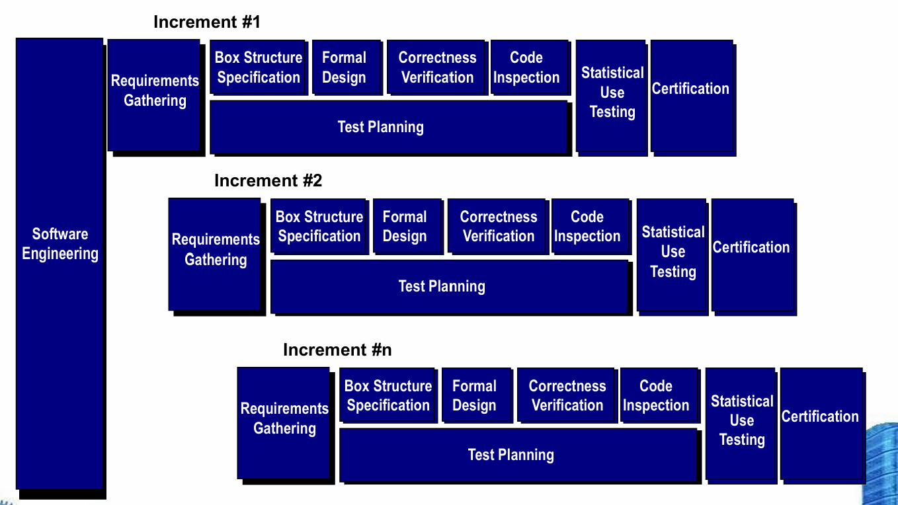

# Chapter 28: Formal Modeling and Verification

本节介绍了 **净室软件工程**（Cleanroom Software Engineering）与 **形式化方法**（Formal Methods）。这两种方法在理论和操作上都非常严格，因此目前在软件工程界并未被广泛使用 。主要适用于需要“无懈可击”（极高可靠性）的软件开发场景 。

## 28.1 净室策略 The Cleanroom Strategy

净室策略采用了**增量式**的开发过程，包含多个增量阶段（增量 #1、增量 #2 直至增量 #n）。每个增量阶段涵盖的工程活动包括：

- 需求收集：为每个增量阶段定义客户级别的需求描述 。
- 盒结构规约：用于描述系统的功能规格说明 。
- 形式化设计：在增量过程中，将规格说明（称为“黑盒”，black box）进行**迭代细化**，逐步转化为类似于架构设计和过程设计的形式（分别被称为“状态盒”和“明盒”/“白盒”，**clear box**） 。
- 正确性验证：验证工作从最高级别的盒结构（规格说明）开始，使用一系列“正确性问题”逐步向设计细节和代码层面推进 。如果这些问题不足以证明规格说明的正确性，则需要引入更为严谨的形式化（数学）验证方法 。
- 代码生成、审查与验证：将使用专门语言表示的盒结构规格说明，转化为相应的目标编程语言 。
- 统计测试规划：规划并设计一套能够模拟“使用概率分布”的测试用例集 。
- 统计使用测试：基于统计抽样（即上述的概率分布），执行一系列测试，这些抽样涵盖了目标用户群体可能触发的所有程序执行路径 。
- 认证：一旦完成了验证、审查和使用测试（并且所有发现的错误均已纠正），该增量版本便可被认证为处于就绪状态，可以进行系统集成 。

## 28.2 功能规约 Functional Specification

在增量过程中，将规格说明（称为“黑盒”，black box）进行迭代细化，逐步转化为类似于架构设计和过程设计的形式（分别被称为“状态盒”和“明盒”/“白盒”，clear box） 。

## 28.3 净室设计 Cleanroom Design

1. **设计细化（Design Refinement）**   
    - 如果将函数 $f$ 细化为依次执行的序列 $g$ 和 $h$，那么对于 $f$ 的所有输入，其正确性验证条件是：先执行 $g$ 再执行 $h$ 的效果是否等同于执行 $f$？
    - 如果将函数 $f$ 细化为条件分支（if-then-else 结构），对于 $f$ 的所有输入，其正确性验证条件是：当条件 $<c>$ 为真时，执行 $g$ 是否等同于执行 $f$？当条件 $<c>$ 为假时，执行 $h$ 是否等同于执行 $f$？
    - 如果将函数 $f$ 细化为循环结构，对于 $f$ 的所有输入，其正确性验证条件是：
        - 程序是否保证能够终止？
        - 当条件 $<c>$ 为真时，先执行 $g$ 然后再执行 $f$ 的效果是否等同于执行 $f$？当条件 $<c>$ 为假时，跳过该循环是否仍然等同于执行 $f$？
2. **设计验证（Design Verification）**
    - 这种方法将软件验证简化为一个有限的过程 。
    - 它允许净室团队对每一行设计和代码进行严格的逻辑验证 。
    - 它能够帮助软件达到接近零缺陷的质量水平 。
    - 这种验证方法具备良好的可扩展性，适用于大规模项目 。
    - 相比于传统的单元测试，它能产出质量更高、更可靠的代码 。

## 28.4 净室测试 Cleanroom Testing

1. **统计使用测试（Statistical Use Testing）** 
    - 该测试旨在验证程序在真实环境下的实际使用情况 。
    - 需要先确定一个**“使用概率分布”（Usage Probability Distribution）** 。
        - 通过分析规格说明，识别出一系列外部输入刺激（Stimuli） 。
        - 这些刺激会导致软件改变其原有行为 。
        - 基于此创建不同的使用场景 。
        - 为每一种输入刺激分配相应的触发概率 。
        - 最后，根据这个使用概率分布，为每种刺激生成对应的测试用例 。
2. **认证过程（Certification）** 
    - 必须首先创建各种使用场景 。
    - 明确规定用户的使用配置（使用剖面） 。
    - 根据该使用配置生成对应的测试用例 。
    - 执行测试，并详细记录与分析发生的故障数据 。
    - 计算软件的可靠性指标并进行最终认证。
3. **认证模型（Certification Models）**  
    - **抽样模型（Sampling model）**：软件测试通过执行 $m$ 个随机测试用例来进行评估，如果在测试中没有发生故障（或故障数低于规定阈值），则软件通过认证 。这里的变量 $m$ 的值是通过数学演算推导出来的，以确保软件达到所要求的可靠性水平 。
    - **组件模型（Component model）**：用于认证由 $n$ 个独立组件构成的复杂系统 。组件模型使分析人员能够计算出组件 $i$ 在任务完成前发生故障的概率 。
    - **认证模型（Certification model）**：对整个系统的整体可靠性进行预测并予以认证 。

## 28.5 形式化方法 Formal Methods

1. **传统规格说明存在的主要问题**
    - 逻辑矛盾（contradictions）
    - 表述歧义（ambiguities）
    - 模糊不清（vagueness）
    - 细节不完整（incompleteness）
    - 抽象层次混杂（mixed levels of abstraction）
2. **形式化规约（Formal Specification）** 
    - 可实现一致性、完整性以及消除歧义，是所有软件规约方法的终极目标 。
    - 规约语言的形式化语法确保了需求或设计只能被唯一精确地解释，从而消除了自然语言（如英语）或非标准化图形符号在解读时容易产生的歧义问题 。
    - 借助集合论和逻辑符号的强大描述能力，可以清晰、准确地陈述客观事实和业务需求 。
    - 通过数学证明，确保初始陈述可以（利用推理规则）形式化地映射到规格说明后续的设计中，从而严格保障了系统前后的一致性 。
3. **核心概念**
    - **数据不变量（data invariant）**：在包含数据状态的系统执行全生命周期中，始终必须保持为真的逻辑条件 。
    - **状态（state）**：许多形式化语言（如 OCL）都运用了“状态”的概念。即一个系统可以处于几种离散状态之一，每种状态都代表了系统一种外部可观察的行为模式 。Z 语言则将状态定义为系统所访问和修改的存储数据集合 。
    - **操作（operation）**：指在系统中发生的动作，这些动作会对状态数据执行读取或写入操作 。
    - **前置条件（precondition）**：定义了允许某个特定操作合法执行的前提环境或约束条件 。
    - **后置条件（postcondition）**：定义了当某个操作顺利完成后，系统状态会发生怎样的预期变化 。