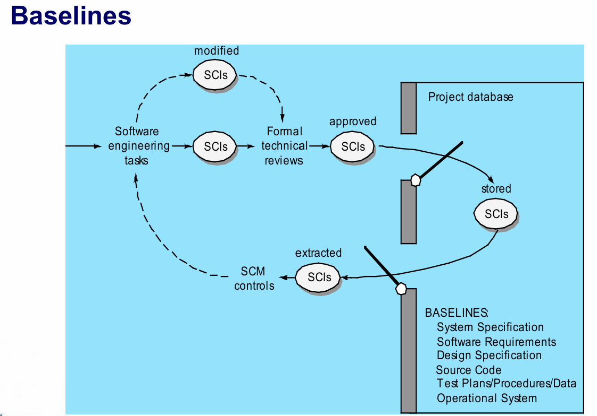

# Chapter 29: Configuration Management

## 29.1 导言与基本概念

- **软件工程的“第一定律”**：无论您当前处于系统生命周期的哪个阶段，系统总是会发生**变更**，并且这种对变更的渴望将贯穿整个生命周期 。
- **变更是如何发生的？** 软件变更通常来源于三个方面：业务需求的改变、技术要求的改变，以及用户需求的改变 。
- **变更会影响什么？** 这些变更会对项目计划、软件模型、代码、测试内容以及其他文档和数据产生直接影响 。
- **软件配置的组成部分**：一个完整的软件配置主要由三部分构成：程序（Programs）、文档（Documents）和数据（Data） 。

## 29.2 基线与软件配置对象

- **什么是“基线”（Baselines）？** 根据 IEEE 的定义，基线是指已经过正式评审并达成一致的规格说明或产品 。基线在此后将作为进一步开发的基础，并且只能通过正式的变更控制程序进行修改 。
- 从开发过程来看，基线是软件开发中的一个关键里程碑 。它标志着一个或多个软件配置项（SCI，Software Configuration Items） 的交付，并且这些配置项已经通过了正式的技术评审获得了批准 。常见的基线包括系统规格说明、软件需求、设计规格说明、源代码、测试计划/数据以及运行系统等 。
    
    
    
- **软件配置对象（Software Configuration Objects）**：具体的配置对象包括数据模型、设计规格说明（涵盖数据、架构、模块和接口设计）、测试规格说明（测试计划、流程和用例）、各类组件说明，以及最终的源代码 。
    
    
    

## 29.3 SCM 存储库（Repository） 与核心特性

1. SCM：Software Configuration Management，软件配置管理
2. **SCM 存储库的作用**：它是一套机制和数据结构的集合，旨在帮助软件团队以有效的方式管理变更 。它能提供数据完整性、信息共享、工具集成、数据集成、方法论执行以及文档标准化等功能 。
3. **存储库的内容**：它不仅存储代码，还包含了业务内容（如用例、业务规则）、分析与设计模型、构建内容、项目管理内容（如估算、进度表）、验证与确认（V&V）内容，以及各类规范和手册文档 。
4. **存储库的核心特性**：
    - **版本控制**：保存所有版本，允许团队管理产品发布或回溯到早期版本 。
    - **依赖追踪与变更管理**：管理存储库中数据元素之间的各种复杂关系 。
    - **需求追踪**：能够追踪特定需求规格说明最终产生的各项设计和构建交付物 。
    - **配置管理**：跟踪代表特定项目里程碑或生产发布的一系列配置 。
    - **审计跟踪**：记录下是谁、在何时、因为什么原因进行了这些变更 。
5. **SCM 的要素**
    - **组件要素（Component elements）**：这是一组与文件管理系统（例如数据库）相结合的工具，使得团队能够访问并管理每一个软件配置项 。
    - **过程要素（Process elements）**：这是一系列程序和任务的集合，它们为所有参与计算机软件管理、工程开发及使用的人员，定义了一种行之有效的变更管理（及相关活动）方法 。
    - **构建要素（Construction elements）**：这是一套用于自动化构建软件的工具，它能确保项目组装的是正确的、经过验证的组件集合（即正确的版本） 。
    - **人为要素（Human elements）**：为了实施有效的软件配置管理，软件团队需要使用一套整合了其他配置管理要素的工具和过程特性 。

## 29.4 SCM 流程与变更控制

1. **SCM 流程（SCM Process）**
    
    
    
    - 完整的 SCM 流程包含五个核心活动：识别、版本控制、变更控制、配置审计和状态报告 。
    - **版本控制（Version Control）**：结合了一系列程序与工具，主要通过项目数据库（存储库）、版本管理能力、构建（make）功能以及问题（缺陷）跟踪能力来管理软件开发过程中不同版本的配置对象 。
2. **变更控制流程（Change Control Process）**：
    - **第一阶段（评估与审批）**：识别出变更需求或收到用户请求后，由开发者进行评估并生成变更报告，随后交由变更控制机构进行决策（排队处理或拒绝） 。
    - **第二阶段（修改）**：分配人员“检出”（check-out） 相关的配置项（SCIs），执行具体的修改，然后进行评审和审计，为测试建立新的“基线” 。
    - **第三阶段（发布）**：执行质量保证（SQA） 和测试，“检入”（check-in） 修改后的配置项，将其晋级到下一个发布版本中，并进行重新构建和最终的审查 。
    - **审计（Auditing）与状态报告**：通过 SQA 计划和变更请求（Change Request）对配置项进行 SCM 审计，并对变更报告进行状态核算与定期汇报 。

## 29.5 Web 与移动应用的特殊配置管理

针对 Web 和移动端应用的开发，软件配置管理面临着独特的挑战：

1. **主要挑战**：
    - **内容庞杂**：包含大量的文本、图形、脚本、音视频和动态页面，需要合理地组织这些配置对象 。
    - **人员随意性**：开发往往相对随意（ad hoc），团队里的任何人都有可能随意创建或修改内容 。
    - **规模效应**：哪怕极其微小的改动，在庞大的应用中也可能引发不可预见的严重后果 。
    - **权责模糊：**同时，应用的所有权、信息的准确性由谁负责、变更的成本由谁承担，往往界限模糊 。
2. **内容管理（Content Management） 的三个子系统**：
    - **收集子系统（The Collection Subsystem）**：负责创建/获取内容，将其转换为 HTML/XML 等标记语言，并打包以便在客户端展示 。
    - **管理子系统（The Management Subsystem）**：包含内容数据库、数据库检索/管理功能，以及版本控制和变更审计等配置管理功能 。
    - **发布子系统（The Publishing System）**：利用模板（包括静态元素、发布服务函数和外部企业服务接口）将存储库中的内容提取并格式化，发送给客户端浏览器 。