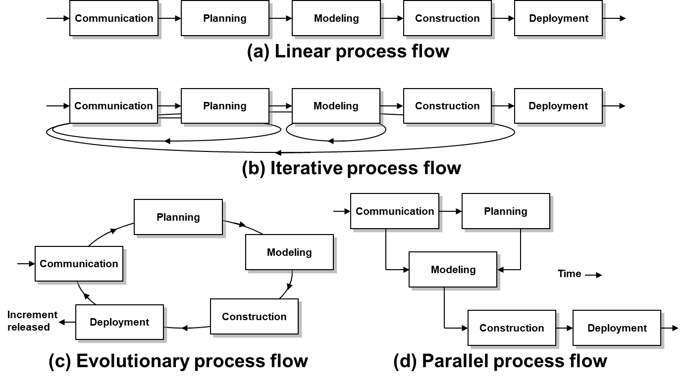

# Chapter 3: Software Process Structure

## 3.1 A Generic Process Model 通用过程模型

1. **通用过程框架（Generic Process Framework）**
    - 通用过程框架由若干**框架活动**（Framework Activities）组成。
    - 每一个框架活动包含多个**动作**（Action），每个动作下设具体的**任务集**（Task Set）。
    - 在框架活动之外，还存在**普适性活动**（Umbrella Activities）。它们不属于“通用过程框架”的某个特定的框架活动，而是贯穿整个软件生命周期。
    - 本节与 Chapter 2 重复，细节详见 Chapter 2。
2. **过程流（Process Flow）**
    
    四种基本的软件过程流模型 ：
    
    - **线性过程流**（Linear）
    - **迭代过程流**（Iterative）：在进入下一阶段前重复一个或多个活动。
    - **演化过程流**（Evolutionary）：以循环方式发布多个增量版本 。
    - **并行过程流**（Parallel）：多个活动（如建模与构建）在同一时间段内同时进行。
    
    
    

## 3.2 Process Patterns 软件过程模式

1. **软件过程模式的定义**
    - 软件过程模式定义了一系列相关的活动、动作、任务、工作产品以及行为，为特定常见问题提供解决方案。
    - 软件过程模式是一种模版，它是对软件开发成功经验的总结，使得团队可以快速套用成熟的模板，构造一套高质量的软件过程。
2. **软件过程模式的类别**
    
    三个层级，从微观到宏观：
    
    - 任务模式（Task Pattern）：针对具体的技术动作或任务（例：如何进行单元测试）。
    - 阶段模式（Stage Pattern）：针对某个框架活动（例：如何进行需求分析阶段）。
    - 阶段流模式（Phase Pattern）：定义框架活动之间的顺序或流向。
3. **软件过程模式的组成要素**
    
    为了让一个模式可以被重复使用，通常使用下述模版来描述：
    
    | **要素** | **解释** |
    | --- | --- |
    | **模式名称 (Pattern name)** | 一个能体现其本质的简短名称（如：客户沟通模式）。 |
    | **类别 (Type)** | 任务模式/阶段模式/阶段流模式。 |
    | **意图 (Intent)** | 描述这个模式到底要解决什么问题，其目标是什么。 |
    | **初始上下文 (Initial context)** | **前提条件**。在使用这个模式之前，必须具备哪些环境或条件。 |
    | **解决方案 (Solution)** | **核心步骤**。具体描述如何正确地实施该模式。 |
    | **产生结果 (Resulting context)** | **执行结果**。模式实施成功后，环境会发生什么变化，留下了什么成果。 |
    | **相关模式 (Related patterns)** | 列出与其相关的其他模式，方便组合使用。 |
    | **已知应用 (Known uses/examples)** | 实际案例，说明这个模式以前在哪些具体场景中成功应用过。 |

## 3.3 Process Assessment 软件过程评估

1. **软件过程评估的动态反馈环**
    
    
    
    - 行业主流评估标准：SCAMPI、CBA IPI、SPICE(ISO/IEC15504)、ISO9001:2000 for Software
2. **能力成熟度模型集成（The Capacity Maturity Model Integration，CMMI）**
    
    一套评估标准，用于衡量和提升软件开发与组织的综合能力。分为 6 个成熟度等级：
    
    - **Level 0**（不完整，Incomplete）：任务未执行或未达到预定目标
    - **Level 1**（已执行，Performed）：能够完成生产工作产品所需的基本工作任务。
    - **Level 2**（已管理，Managed）：确保人员拥有充足资源，利益相关者积极参与，且工作产品受到监控、审查和评估。
    - **Level 3**（已定义，Defined）：过程已文档化、标准化，并集成到组织级别的标准过程体系中。
    - **Level 4**（定量管理，Quantitatively Managed）：利用详细的度量手段，对过程和产品进行定量的理解与控制。
    - **Level 5**（优化中，Optimizing）：基于量化反馈持续改进过程，并不断测试创新想法。

## 3.4 课后习题节选

