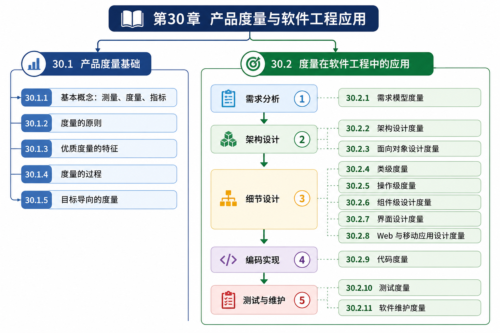

# Chapter 30: Product Metrics



## 30.1 产品度量基础

### 30.1.1 基本概念：测量、度量、指标

1. **测量（Measure）**
    - 定义：提供对产品或过程的某种属性的范围、数量、维度、容量或大小的定量指示。
    - 解释：对某一属性进行的最基础、最客观的绝对数值记录。
    - 案例：
        - 体检时踩上体重秤，显示“67 公斤”，“172 厘米”。
        - 抽象语法树（AST）解析器文件有 1500 行代码。
        - 某个 C++ 类里定义了 15 个方法。
2. **度量（Metric）**
    - 定义：系统、组件或过程具有给定属性的程度的定量测量（IEEE）。
    - 解释：对两个或多个测量值进行加工、组合，赋予其**比较意义**和**上下文**。
    - 案例：
        - 将你的体重与身高结合，算出 BMI 指数为 22.5。
        - 将 AST 节点的总数与子类总数结合，算出每个 AST 节点类平均包含 3 个子类。
3. **指标（Indicator）**
    - 定义：一种度量或度量组合，用于提供对软件过程、软件项目或产品本身的深入洞察。
    - 解释：将度量结果与行业基准或历史数据进行对比，用来**预警、提供洞察或指导决策**。
    - 案例：
        - 医生看着你的体检报告说：“你的 BMI 连续三个月上升，超过了健康值，这是一个高血脂风险的指标。”
        - 当模块的“复杂度”度量持续飙升时，它是一个“指标”，暗示代码可能即将变得难以维护。

### **30.1.2 度量的原则**

在动手收集任何数据之前，我们必须遵循以下四个核心原则：

1. 目标先行（Establish Objectives）
    - **定义**：在数据收集开始之前，必须明确建立测量的目标。
    - **解释**：不要为了测量而测量。如果没有目标，收集来的一堆数字只会变成无用的数据垃圾。
    - **案例**：在开始统计代码行数前，明确目标是“为了评估项目进度”，还是“为了寻找代码臃肿的模块”。
2. 明确无歧义（Unambiguous Definition）
    - **定义**：每个技术度量都应该以一种明确无歧义的方式进行定义。
    - **解释**：团队内所有人对度量标准的理解必须完全一致，不能有操作上的模糊地带。
    - **案例**：当我们说“测量代码行数（LOC）”时，必须明确规定：是否包含空行？是否包含注释行？是否包含只写了一个大括号 `{` 的行？
3. 坚实的理论支撑（Valid Theory）
    - **定义**：度量的推导应基于在该应用领域内有效的理论（例如，面向设计的度量应借鉴基本的设计概念和原则）。
    - **解释**：度量公式不能是拍脑袋决定的，它必须符合软件工程或计算机科学的基础常识。
    - **案例**：评估一段 C++ 代码的控制流复杂性，不能只看文件大小，而应基于图论（计算执行路径的独立分支数，如圈复杂度），这才是科学的。
4. 量体裁衣（Tailored to Products/Processes）
    - **定义**：度量应当进行定制，以最佳地适应特定的产品和研发过程。
    - **解释**：没有放之四海而皆准的万能度量标准。
    - **案例**：为一个底层的类型检查器（TypeChecker）设计的执行效率度量标准，绝对不适用于评估一个提供可视化界面的网络配置代理工具（后者更应关注 UI 响应时间或点击转化率）。

### **30.1.3 优质度量的特征**

我们设计出的任何度量标准，如果想要真正落地，应当努力符合以下六个特征：

1. 简单且可计算（Simple and computable）
    - **解释**：工程师很容易学习如何推导它，且计算过程不会耗费过多的时间或精力。如果算一个指标需要跑三天的脚本，那它就失去了日常指导意义。
2. 经验与直觉上的说服力（Empirically and intuitively persuasive）
    - **解释**：度量的结果应该符合软件工程师的直观常识。如果老程序员一眼看出这堆代码写得很烂，但度量工具却给出了“满分”，那说明这个度量标准是失效的。
3. 一致性与客观性（Consistent and objective）
    - **解释**：无论由初级程序员还是资深架构师来测，度量都应始终产生无歧义的结果。它不能受到主观情绪的影响。
4. 单位与量纲的一致性（Consistent in its use of units and dimensions）
    - **解释**：数学计算中不应出现荒谬的单位组合。比如，不能把“代码行数”和“加载秒数”直接相加得到一个毫无物理意义的数字。
5. 独立于编程语言（Programming language independent）
    - **解释**：高质量的度量应基于分析模型、设计结构本身，而不局限于语言。（当然，部分代码级度量例外）。一个好的架构度量，无论是评估 C++ 项目还是 Python 项目，都应该是有效的。
6. 有效的质量反馈机制（Effective mechanism for quality feedback）
    - **解释**：度量不仅是用来“打分”的，更是用来“治病”的。它应该能为软件工程师提供明确的指引，引导他们做出更高质量的最终产品。

### **30.1.4 度量的过程**

测量的过程是一个由五个步骤组成的闭环：

1. 公式化（Formulation）
    - 推导出适合目标软件表示形式的测量和度量标准。
    - *案例*：决定用“函数调用深度”来公式化表示递归下降解析器的复杂程度。
2. 收集（Collection）
    - 建立用于积累公式化度量所需数据的机制（尽可能自动化）。
    - *案例*：编写一个脚本，结合 CI/CD 流水线，每次提交时自动提取各个模块的函数调用关系。
3. 分析（Analysis）
    - 计算度量结果，并在必要时应用数学和统计学工具进行科学的论证与处理。
    - *案例*：将收集到的调用深度数据进行统计，发现有 5% 的函数调用深度超过了 20 层。
4. 解释（Interpretation）
    - 评估度量结果。单纯的数据没有意义，必须为每一项度量建立解释指南和建议，告诉团队数据反映了什么问题。
    - *案例*：结合代码发现，这 5% 过深的调用通常伴随着严重的性能瓶颈和栈溢出风险。
5. 反馈（Feedback）
    - 将从解释中得出的优化建议传达给软件工程团队。
    - *案例*：在团队周报中指出该问题，并建议将部分深层递归重构为迭代循环或进行尾递归优化。

### **30.1.5 目标导向的度量**

1. **GQM 范式（Goal/Question/Metric Paradigm）**
    
    这是一种业界经典的、自上而下的目标导向度量思维框架。
    
    - **目标（Goal）**：建立一个明确的测量目标，具体针对要评估的过程活动或产品特征。
    - **问题（Question）**：定义一系列必须回答的问题，才能实现该目标。
    - **度量（Metric）**：确定格式良好的度量标准，以帮助回答这些问题。
2. **示例：**
    
    GQM 生活案例：制定个人健康管理计划
    
    - （G） 建立目标（套用定义模板）
        - **分析（Analyze）**：个人的日常饮食与运动习惯
        - **目的在于（for the purpose of）**：科学地管理体型，降低健康风险
        - **关注点是（with respect to）**：整体脂肪含量的变化
        - **视角来自（from the viewpoint of）**：一个想变健康的普通人
        - **环境背景（in the context of）**：日常三餐正常吃，缺乏规律运动的生活状态
    - （Q） 定义问题
        - 我最近一直在控制饮食，偶尔也去健身房，我的身材到底有没有实质性的变好？
    - （M） 确定度量
        - 体脂率（由身高、体重、身体电阻大小等测量值计算而得）

## 30.2 度量在软件工程中的应用

### 30.2.1 需求模型（Requirement Model）度量

1. 在需求分析阶段，我们主要有两种度量方向：
    - **基于功能的度量（Function-based metrics）**
        - 通过测量“功能点”的数目，度量系统交付给用户的**功能规模**。
    - 规格说明度量（Specification metrics）
        - 阅读需求文档，通过测量不同类型需求的数量，来作为文档质量的指示器。
        - *通俗解释*：数一数这份需求文档里，有多少是功能需求，有多少是性能需求，有多少是安全需求。如果全是功能需求，没有安全需求，这就暗示了文档质量存在缺陷。
2. **什么是功能点（Function Points, FP）？**
    - **定义**：功能点度量由 Albrecht 首次提出，它可以被有效地用作测量系统交付给用户的**功能规模**的手段。
    - **核心原理**：功能点是使用基于经验的关系推导出来的。它依赖于对软件“信息域（Information Domain）”的直接测量，以及对软件复杂性的评估。
    - **生活化案例**：评估一套房子的规模，内行人不会去数“用了多少块砖”，因为砖有大有小，而且大头贴砖和实心砖不一样。内行人看的是“几室几厅几卫”、“有几个阳台”。**“室、厅、卫”就是房子的“功能点”**。无论房子是用木头盖还是水泥盖，功能点是稳定不变的。
3. 功能点的基本类型
    
    像财务清点资产一样，清点系统里的以下 5 种基本元素。
    
    1. 外部输入（External Inputs, EIs）
        - **通俗解释**：用户或外部系统**推给**我们系统的数据，通常会导致内部数据的更新。
        - **实战案例**：用户注册时填写的“注册表单”；或者电商系统里你点击的“加入购物车”操作。
    2. 外部输出（External Outputs, EOs）
        - **通俗解释**：我们系统经过**计算和处理后**，推给用户或外部系统的数据。
        - **实战案例**：系统月底自动生成的“包含了总销售额和利润率的 PDF 财务报表”；或者支付成功后弹出的“电子小票”。
    3. 外部查询（External Inquiries, EQs）
        - **通俗解释**：一种简单的数据读取。用户输入一个条件，系统原封不动地把数据查出来给你（不涉及复杂的数学计算或数据修改）。
        - **实战案例**：在学校教务系统里输入你的学号，查询你的“基本学籍信息”。
    4. 内部逻辑文件（Internal Logical Files, ILFs）
        - **通俗解释**：我们系统**自己维护**的、存在系统内部的逻辑数据组。
        - **实战案例**：你的教务系统背后的 MySQL 数据库里的 `Student（学生表）` 或 `Course（课程表）`。
    5. 外部接口文件（External Interface Files, EIFs）
        - **通俗解释**：**别人系统维护**的数据，我们系统只是拿来“读一下”作为参考，我们无权修改。
        - **实战案例**：你的外卖 App 在结算时，调用了“微信支付的汇率/状态接口”。这个微信侧的数据对你来说就是 EIF。
4. **功能点计算模型实战**
    
    认清了上面 5 个元素，我们就可以查表计算了。Albrecht 团队通过大量的历史项目统计，给每种元素都赋予了不同难度级别（简单、平均、复杂）的**权重因子（Weighting factor）**。
    
    计算时，将统计出的数量乘以对应的权重，最后将所有结果相加，即可得到**总计数值（Count Total）**
    
    | **信息域值（Domain Value）** | **计数（Count）** | **简单（Simple）** | **平均（Average）** | **复杂（Complex）** |
    | --- | --- | --- | --- | --- |
    | **外部输入（EIs）** | （数一数有几个） | × 3 | × 4 | × 6 |
    | **外部输出（EOs）** | （数一数有几个） | × 4 | × 5 | × 7 |
    | **外部查询（EQs）** | （数一数有几个） | × 3 | × 4 | × 6 |
    | **内部逻辑文件（ILFs）** | （数一数有几个） | × 7 | × 10 | × 15 |
    | **外部接口文件（EIFs）** | （数一数有几个） | × 5 | × 7 | × 10 |
5. **课堂互动**
    
    **情境：**“同学们，假设你们现在接到了学校图书馆的一个私活，要求开发一个超级简单的『图书检索小程序』。需求如下：
    
    1. 学生可以在界面上输入书名，点击搜索，看到图书的位置（不涉及复杂计算）。
    2. 图书的库存数据直接存在我们小程序的后台数据库里。
    3. 为了防止非本校人员使用，系统在登录时，需要后台去调用一下‘学校一卡通中心’的接口来验证身份。
    
    **提问：**请大家帮我把这 3 个需求，分别归类到那 5 种信息域元素中去！”
    
    **答案：**
    
    1. “输入书名查位置” —— 这属于简单的读数据，归类为 **外部查询（EQs）**。
    2. “存在后台的图书库存数据” —— 这是我们自己维护的数据库，归类为 **内部逻辑文件（ILFs）**。
    3. “学校一卡通中心的接口数据” —— 这是别人系统维护的数据，我们只读不写，归类为 **外部接口文件（EIFs）**。

### 30.2.2 架构设计（Architectural Design）度量

1. 扇入和扇出
    - **扇出（Fan-out）**：一个模块直接调用（控制）的其他模块的数量。扇出过大，说明这个模块是个“控制狂”（上帝模块），管得太多，逻辑极易出错。
    - **扇入（Fan-in）**：一个模块**被多少个其他模块调用**。扇入大，说明这个模块是底层核心（比如某个通用的工具类），复用率高，但一旦修改它，牵一发而动全身。
2. 架构设计度量的三大公式
    
    **1. 结构复杂性（Structural Complexity）**
    
    - **公式推导**：结构复杂性被定义为扇出的函数：`Structural complexity = g（fan-out）`。
    - **通俗解释**：评估架构的纯物理连接结构。如果一个主控模块（Main）需要直接调用多达 20 个子系统，它的结构复杂性就极高，这通常意味着架构师没有做好中间层的抽象与隔离。
    
    **2. 数据复杂性（Data Complexity）**
    
    - **公式推导**：数据复杂性被定义为输入输出变量与扇出的函数：`Data complexity = f（input & output variables, fan-out）`。
    - **通俗解释**：光看调用关系还不够，还要看“带了多少货”。如果模块 A 调用模块 B（扇出为 1，结构复杂性不高），但每次调用都要传递 15 个极其复杂的参数对象（输入/输出变量极多），那么该模块的数据复杂性依然会爆表。
    
    **3. 系统复杂性（System Complexity）**
    
    - **公式推导**：系统整体的复杂性被定义为结构复杂性与数据复杂性的综合函数：`System complexity = h（structural & data complexity）`。
    - **通俗解释**：它是对控制流（调谁）和数据流（传什么）的综合考量。
3. 经典的架构度量模型
    - **HK 度量（HK Metric）**
        - **核心思想**：将架构复杂性作为扇入和扇出的函数来进行综合计算。
        - **应用场景**：通过平衡扇入和扇出的比值，寻找架构中的瓶颈模块。比如寻找那些“扇入极大（到处都在用），但扇出也极大（到处依赖别人）”的危险模块，这种模块往往是系统崩溃的导火索。
    - **形态度量（Morphology Metrics）**
        - **核心思想**：它是模块数量以及模块之间接口数量的函数。
        - **通俗解释**：这就好比我们在画 UML 组件图时，数一数图上有多少个方块（模块），以及方块之间连了多少条线（接口）。线越密集，形态复杂性越高。

### 30.2.3 面向对象设计（OO Design）度量

1. 为什么需要 OO 度量
    
    面向对象系统有一些过程式软件没有那么突出的特征，因此必须开发专门的 OO 度量：
    
    - **局部化（Localization）**：信息在程序中的集中方式。
    - **封装（Encapsulation）**：数据和处理被打包在一起。
    - **信息隐藏（Information Hiding）**：通过安全接口隐藏内部细节。
    - **继承（Inheritance）**：一个类的职责如何传递给另一个类。
    - **抽象（Abstraction）**：关注本质而屏蔽细节的机制。
2. OO 可测特征
    
    将 OO 设计的质量拆成 9 个可以观察和度量的方面：
    
    1. **规模（Size）**
        - 定义：可从 population、volume、length、functionality 四个角度理解对象系统的规模。
        - 通俗解释：类有多少、方法有多少、系统做了多少事。
        - 案例：一个简单的课程管理系统只有 12 个类；一个大型 ERP 子系统可能有 200 多个核心类。
    2. **复杂性（Complexity）**
        - 定义：OO 设计中的类彼此之间如何相互关联。
        - 通俗解释：类图像蜘蛛网一样缠在一起，复杂性就高。
        - 案例：一个 `SuperController` 同时依赖 `User`、`Order`、`Payment`、`Notification`、`Audit` 等十多个类，一改就牵一串。
    3. **耦合（Coupling）**
        - 定义：OO 设计元素之间的物理连接程度。
        - 通俗解释：一个类离开别的类就活不了，说明耦合大。
        - 案例：很多 AI Agent 项目里，一个 `AgentOrchestrator` 直接依赖模型类、工具类、会话类、向量库类、权限类、日志类，这类代码往往维护痛苦。
    4. **充分性（Sufficiency）**
        - 定义：某个抽象是否具备当前应用所要求的特征。
        - 通俗解释：这个类是不是“该有的功能都有了”，而不是只有一个空壳。
        - 案例：如果 `PaymentMethod` 类没有提供统一的 `pay（）` 行为，只是堆几个字段，那抽象就是不充分的。
    5. **完整性（Completeness）**
        - 定义：对抽象或设计组件可复用程度的一种间接暗示。
        - 通俗解释：这个设计除了能完成眼前任务，还能不能比较完整地服务于类似场景。
        - 案例：一个“消息发送接口”如果同时考虑短信、邮件、站内信，完整性通常比只支持短信的版本更强。
    6. **内聚（Cohesion）**
        - 定义：所有操作是否共同服务于一个清晰且单一的目标。
        - 通俗解释：一个类内部的方法是不是都在干同一类事。
        - 案例：`StudentService` 里既写选课逻辑，又写图表渲染，又写 Excel 导出，内聚性显然很差。
    7. **原始性 / 原子性（Primitiveness）**
        - 定义：可应用到操作和类，表示一个操作是否足够“原子化”。
        - 通俗解释：一个方法是不是一步一事，而不是把十几件事硬塞进来。
        - 案例：一个 `processAll（）` 方法里同时完成鉴权、查询、转换、写库、发消息、打日志，就违反了原子性。
    8. **相似性（Similarity）**
        - 定义：两个或多个类在结构、功能、行为或目的上的相似程度。
        - 通俗解释：这两个类是不是其实长得太像，已经到了值得抽象出父类或公共组件的程度。
        - 案例：`StudentReportGenerator` 和 `TeacherReportGenerator` 如果 80% 逻辑相同，就应考虑重构。
    9. **易变性（Volatility）**
        - 定义：发生变化的可能性。
        - 通俗解释：这个类将来会不会经常改。
        - 案例：和政策、计费、推荐策略相关的类往往易变性很高；底层数学工具类则相对稳定。
3. **概念比较与辨析**
    - **充分性 vs 完整性**
        - 充分性更偏向“当前够不够用”。
        - 完整性更偏向“设计是否具备较强复用和扩展价值”。
    - **复杂性 vs 耦合**
        - 复杂性是更宽泛的概念，描述系统关系是否难以理解。
        - 耦合是复杂性的一个重要来源，强调依赖关系强不强。
    - **内聚低 vs 类大**
        - 类大不一定有罪。如果一个类大，但所有方法都服务于同一职责，仍可能是高内聚。
        - 真正危险的是“又大又杂”，即方法多且主题分散。

### 30.2.4 类级度量（Class-Oriented Metrics）

1. CK 经典度量集（Chidamber and Kemerer）
    1. **每类加权方法数（WMC, Weighted Methods per Class）**
        - 通俗解释：一个类到底“有多忙”。
        - 如果一个类有非常多的方法，或者方法本身很复杂，WMC 就会升高。
        - **工程含义**：WMC 高往往意味着该类承担了太多职责，理解、测试和维护都更困难。
    2. **继承树深度（DIT, Depth of Inheritance Tree）**
        - 通俗解释：从这个类往上爬父类，要爬几层。
        - **工程含义**：DIT 深意味着复用潜力大，但理解成本、调试成本和副作用传播也更强。
        - **案例**：很多大型 GUI 框架或 ORM 框架中，某些业务类继承链深达 5 层以上，新手一改就翻车。
    3. **子类个数（NOC, Number of Children）**
        - 通俗解释：这个类下面带了多少个“孩子”。
        - **工程含义**：NOC 大说明这个类往往是一个重要抽象或基类，但它一旦变化，影响范围极广。
    4. **类间耦合（CBO, Coupling Between Object Classes）**
        - 通俗解释：这个类和多少别的类牵扯不清。
        - **工程含义**：CBO 高说明依赖太多，改动时容易“连锁爆炸”。
    5. **类响应集合（RFC, Response For a Class）**
        - 通俗解释：给这个类发一个消息，它最终可能触发多少个方法响应。
        - **工程含义**：RFC 高意味着行为路径长，测试覆盖与行为预测都更困难。
    6. **方法缺乏内聚（LCOM, Lack of Cohesion in Methods）**
        - 通俗解释：类中的方法彼此像不像“一家人”。
        - **工程含义**：LCOM 高说明这个类内部的方法服务于不同的数据和职责，是典型的“该拆类了”的信号。
2. Lorenz and Kidd 提出的类级度量
    - **类大小（Class Size）**
        - 看类的数据成员和操作总规模。
    - **子类重写操作数（Number of operations overridden by a subclass）**
        - 看子类覆盖了父类多少行为。
    - **子类新增操作数（Number of operations added by a subclass）**
        - 看子类额外扩展了多少新能力。
    - **专门化指数（Specialization Index）**
        - 用于评估子类究竟是在“合理专门化”，还是“过度背离”父类原本设计。
3. MOOD 度量套件
    - **方法继承因子（Method Inheritance Factor）**：系统到底多大程度上在复用父类行为？
    - **耦合因子（Coupling Factor）**：对象之间是不是缠得太紧？
    - **多态因子（Polymorphism Factor）**：系统是否真正利用了 OO 的动态分发优势？

### 30.2.5 操作级度量（Operation-Oriented Metrics）

可以从三类典型度量来分析：

1. **平均操作大小（Average operation size）**
    - 辨析：一个方法很短，就一定好吗？
    - 回答：不一定。如果它短是因为逻辑被切得支离破碎，到处跳转，整体理解成本仍然很高。
2. **操作复杂性（Operation complexity）**
3. **每个操作的平均参数数（Average number of parameters per operation）**
    - 辨析：一个方法参数多，一定不好吗？
    - 回答：不一定。如果是数据传输对象（DTO）被合理封装，参数表面上可能变少，但真正复杂度未必下降。

### 30.2.6 组件级设计度量（Component-Level Design Metrics）

可以从三类典型度量来分析：

1. **内聚度量（Cohesion metrics）**
    - 它是数据对象以及这些对象定义位置的函数。
    - 通俗解释：一个组件里的东西是不是围绕着同一主题在工作。
2. **耦合度量（Coupling metrics）**
    - 它是输入输出参数、全局变量以及所调用模块数量的函数。
    - 通俗解释：这个组件要想工作，是否必须拉上一大票“外援”。
3. **复杂度量（Complexity metrics）**
    - 课件提到已经有成百上千种复杂度量被提出，例如圈复杂度（Cyclomatic Complexity）。
    - 通俗解释：组件内部的控制逻辑有多少独立路径，要测多少种情况才能把它测透。

### 30.2.7 界面设计度量（Interface Design Metrics）

典型度量：**布局适切性（Layout Appropriateness）**

- **原始定义**：布局适切性是布局实体、其地理位置以及在这些实体之间进行转换的“成本”的函数。
- **通俗解释**：界面元素放得对不对，用户完成任务时要不要来回找、来回跳、来回点。
- **生活案例**：
    
    想象你在一个校园教务系统里选课：
    
    - 如果“课程搜索框”在左上角，“筛选条件”藏在二级菜单，“确认选课按钮”在最底部滚动区域，用户就得不停移动视线、滚页面、切菜单。
    - 这种设计的**布局适切性**就比较差。

### 30.2.8 Web 与移动应用设计度量

可以从六类典型度量来分析：

1. **用户界面是否促进可用性（Usability）？**
    - 通俗解释：用户会不会一上手就明白怎么用。
    - 案例：医院挂号 App 如果入口清晰、预约流程短、错误提示明确，就说明可用性较强。
2. **App 的美学风格是否适合应用领域，并且让用户感觉愉悦？**
    - 通俗解释：好看不是越花哨越好，而是“合适”。
    - 案例：银行 App 适合稳重、可信；二次元社区 App 则可以更活泼、更具视觉张力。
3. **内容设计是否以最少努力传递最多信息？**
    - 通俗解释：信息密度高，但阅读负担不能大。
    - 案例：新闻客户端首页如果标题、摘要、分类、推荐理由排布清晰，用户能快速获取信息；如果信息堆叠混乱，就会造成认知疲劳。
4. **导航是否高效、直接？**
    - 通俗解释：用户能不能迅速到达目的地。
    - 案例：短视频平台的“拍摄”“搜索”“消息”“个人主页”入口通常一眼可见，这就是高效导航。
5. **App 架构是否适应用户目标、内容结构与导航流？**
    - 通俗解释：后台与前台结构是不是在为用户的真实任务服务。
    - 案例：一个在线学习平台，如果“看课”“做题”“查看进度”“复习错题”四条主线结构清晰，就说明架构设计是贴合用户目标的。
6. **组件设计是否降低了过程复杂性，并提升正确性、可靠性与性能？**
    - 通俗解释：页面背后的组件系统是不是干净、稳定、好复用。
    - 案例：如果一个移动 App 每个页面都自己造一套按钮、表单、弹窗逻辑，那后期稳定性和维护性都会很差。

### 30.2.9 代码度量

Halstead 软件科学是一组相当经典但也颇具争议的代码度量方法。

- **核心思想**：基于程序中**运算符（operators）** 和 **操作数（operands）** 的种类数与出现次数，推导出关于程序规模、体积、难度、工作量等一系列指标。
- **一句话理解**：它把程序看成一种“符号组合系统”，通过符号统计来评估代码复杂程度。

### 30.2.10 测试度量（Metrics for Testing）

1. 测试工作量也可以借助 Halstead 度量来估算。除此之外，Binder 还提出了一系列直接影响 OO 系统“可测性（Testability）”的设计度量。这些度量包括：
    - **LCOM**：方法缺乏内聚
    - **PAP（Percent public and protected）**：公有和受保护成员的比例
    - **PAD（Public access to data members）**：对数据成员的公共访问程度
    - **NOR（Number of root classes）**：根类的数量
    - **FIN（Fan-in）**：扇入
    - **NOC**：子类个数
    - **DIT**：继承树深度
2. 为什么这些指标会影响测试？因为“难测”的系统通常具有这些共同特征：
    - 职责不清，类内部太散；
    - 暴露了太多内部细节；
    - 继承链太深，行为来源不透明；
    - 依赖太多，构造测试环境成本极高。
3. 案例：为什么 PAD 高不利于测试？
    
    如果一个类的很多数据成员都可以被外部随意读写，那么系统状态就会被很多地方悄悄改变。一旦测试失败，你很难追踪“是谁把它改坏了”。这就像实验室里任何人都能随便动你的实验器材，最后坏了却查不出是谁碰的。
    

### 30.2.11 软件维护度量

1. **软件成熟度指数（Software Maturity Index, SMI）**
    - 是一个软件维护阶段的度量
    - **用于指示一个软件产品的稳定性，尤其是比较不同发布版本之间变化的剧烈程度。**
2. **SMI 计算公式**
    
    ```
    SMI = [MT -（Fa + Fc + Fd）] / MT
    ```
    
    - 变量含义：
        - `MT` = 当前发布版本中的模块总数
        - `Fc` = 当前发布版本中**被修改**的模块数
        - `Fa` = 当前发布版本中**新增**的模块数
        - `Fd` = 与前一版本相比，在当前版本中**被删除**的模块数
    - 核心思想：
        - 如果一个新版本里，大量模块都在改、新增、删除，说明系统还处于剧烈变化中，产品还不稳定。
        - 如果一个新版本里，大部分模块都没动，说明系统趋于成熟和稳定。
        - 因此：**SMI 越接近 1.0，产品越稳定。**