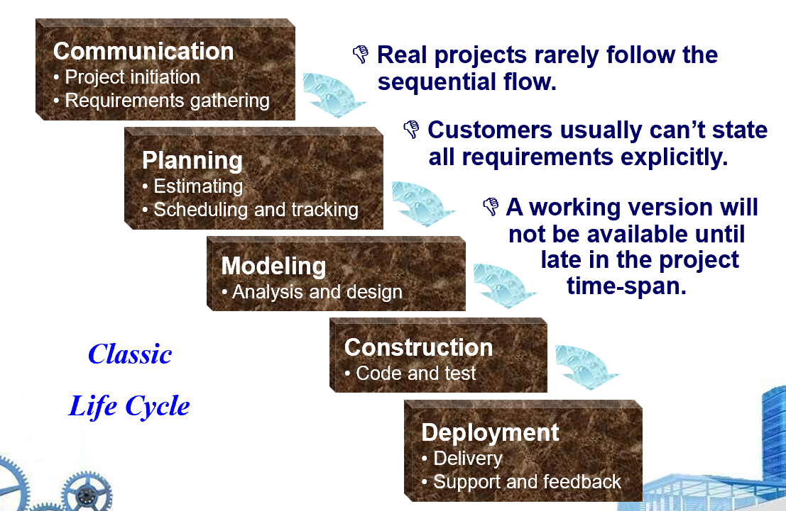

# Chapter 4: Process Models

<aside>
💡

**过程模型（Process Models）是什么？**

- 在通用过程框架中，过程模型决定了框架活动如何被组织、触发以及它们之间的流动顺序。它通过调整框架活动之间的流向（Flow）来呈现不同的形态。
- 过程模式（Process Patterns，Chapter 3）是在过程模型实施过程中，针对特定常见问题的解决方案，它的层级比过程模型低。
- 过程流（Process Flow，Chapter 3）描述了框架活动在时间上和逻辑上的连接方式，它不关心具体的框架活动内容，只关心顺序。所有的过程模型，基本上是由四种基础的过程流演变而来的。
</aside>

## 4.1 Prescriptive Models 规定性过程模型

规定性模型提倡以一种有序的（Orderly）方式进行软件工程工作 。

### 4.1.1 The Waterfall Model 瀑布模型

- **瀑布模型**：又称“经典生命周期”（Classic Life Cycle），是一种顺序开发流程。其沟通、策划、建模、构建、部署过程按线性顺序推进。
- **V 模型**：瀑布模型的一种变体，强调开发阶段与测试活动的对应关系（如需求建模对应验收测试） 。

图：瀑布模型

图：V 模型

### 4.1.2 Incremental Process Models 增量过程模型

- **增量过程模型**：将产品分解为一系列增量。第一个增量通常是核心产品，随后的增量不断增加新功能，直至功能完善。
    
    
    
- **快速应用程序开发模型（Rapid Application Development Model，RAD）**：将系统模块化，由不同的团队同时进行建模和构建，最后统一合并。
    
    
    

### 4.1.3 Evolutionary Process Models 演化过程模型

- **原型模型（Prototyping）**：适用于客户需求不明确的情况。开发一个原型作为第一步，但该原型最终可能需要被抛弃 。

- **螺旋模型（Spiral Model）**：将瀑布模型的系统化步骤与原型模型的迭代特性相结合，并在每一轮迭代中都强制进行风险分析，通常用于规模庞大、复杂且高风险的任务。
- **并发开发模型（Concurrent Development Model）**
    - 状态触发机制（State Transitions）：并发模型将开发活动看作一系列事件。这些事件会触发各个活动、任务或动作在不同状态之间转换（例如：从“等待开发”转为“正在开发”，或从“待评审”转为“已完成”）。
    - 网络化活动结构（Network of Activities）：不同于线性序列，它定义的是一个活动网络。这意味着多个软件工程活动可以同时进行，彼此之间通过状态变化来同步。
    - 适合开发 Client/Server 应用 。
    - 追求灵活性、可扩展性与开发速度，可能会牺牲高质量。

<aside>
💡

**区分原型模型与螺旋模型**

- **驱动机制不同**：
    - **原型模型**是**需求驱动**的。通过快速构建一个“初版”来帮助用户明确那些模糊的需求。
    - **螺旋模型**是**风险驱动**的。它在每一轮迭代中都强制进行**风险分析**（Risk Analysis），旨在消除潜在隐患。
- **完备程度不同**：
    - **原型模型**通常被视为开发生命周期的一个**阶段**或手段，用于辅助需求分析。
    - **螺旋模型**是一个**完整的生命周期模型**，它包含了需求定义、风险评估、工程实现和评审计划的完整闭环，且随着螺旋向外扩张，项目的成本和复杂度会不断累积。
</aside>

## 4.2 Specialized Process Models 特殊过程模型

- 基于组件的开发（Component-Based Development）：以重用性（reuse）为开发目标。
- 形式化方法（Formal Method）：强调需求的数学化规范。
- 面向切面的软件开发（Aspect-Oriented Software Development, AOSD）

## 4.3 The Unified Process 统一过程模型

- 一种以用例（Use Case）驱动、以架构为核心、迭代且增量的软件开发方法，与 UML（统一建模语言）结合非常紧密。
    
    
    

## 4.4 Personal and Team Process Models 个人与团队过程模型

1. **个人软件过程模型（Personal Software Process，PSP）**
    - 分为五个框架活动：Planning、High-Level Design、High-Level Design Review、Development、Postmortem（总结）
2. **团队软件过程模型（Team Software Process，TSP）**
    - 通过一个定义待完成任务的“脚本”启动项目
    - 团队自主管理
    - 鼓励通过数据测量来改善团队流程

## 4.5 课后习题节选

