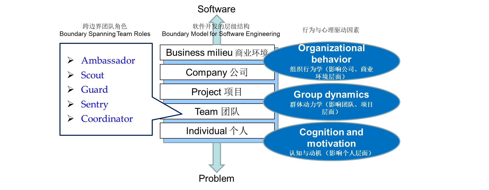

# Chapter 6: Human Aspects

## 6.1 软件工程师的特点

- 个人责任感（Sense of individual responsibility）
- 敏锐地了解团队成员和利益相关者的需求（Acutely aware of the needs of team members and stakeholders）
- 对设计缺陷直言不讳，并提供建设性的批评（Brutally honest about design flaws and offers constructive criticism）
- 在压力下坚韧不拔（Resilient under pressure）
- 公平感的提升（Heightened sense of fairness）
- 注重细节（Attention to detail）
- 务实（Pragmatic）

## 6.2 Psychology of Software Engineering 软件工程心理学

## 6.3 The Software Team 软件工程团队

1. **软件工程团队的属性**
    - 目标感（Sense of purpose）
    - 进步感（Sense of improvement）
    - 参与感（Sense of involvement）
    - 信任感（Sense of trust）
    - 团队成员技能的多样性（Diversity of team member skill sets）
2. **避免“有毒的”团队**
    - 工作氛围紧张激烈，团队成员浪费精力，失去对工作目标的注意力（A frenzied work atmosphere）。
    - 由于个人、业务或技术因素导致团队成员间的摩擦，导致极度沮丧（High frustration）。
    - 流程零散或协调不当，或者定义不当或选择不当的流程模型，影响了完成度（Fragmented or poorly coordinated procedures）。
    - 角色定义不清导致缺乏问责制和相互指责（Unclear definition）。
    - 持续且反复地失败，导致信心丧失和士气低落（Continuous and repeated exposure to failure）。

## 6.4 Team Structure 团队结构

1. **影响团队结构的因素**
    - 待解决问题的难度
    - 最终程序的代码行或函数点大小
    - 团队在一起的合作时间（Team Lifetime）
    - 问题可以模块化的程度
    - 系统对质量和可靠性的要求程度
    - 交付日期的急迫程度
    - 项目所需的社交（沟通）程度
2. **团队的组织范式（Organizational Paradigms）**
    - 封闭范式（Closed paradigm）：按照传统的权威等级构建团队
    - 随机范式（Random paradigm）：松散地组织团队，依赖团队成员的个人主动性
    - 开放范式（Open paradigm）：试图以一种既能实现封闭范式相关控制，又实现随机范式时许多创新的方式来构建团队
    - 同步范式（Synchronous paradigm）：依赖问题的自然分隔，组织团队成员在彼此间几乎没有主动沟通的情况下，专注于问题的各个部分

## 6.5 Agile Teams 敏捷团队

1. **通用敏捷团队（Generic Agile Teams）**
    - 不仅需要每个成员具备极强的个人能力，更强调群体协作。
    - 个体的优先级高于流程，但在实际情况中，组织政治的优先级可能凌驾于个体之上（People trump process and politics can trump people）。
    - 团队自组织，采用适应性团队结构，自治权（Autonomy）高，常采用随机范式、开放范式、同步范式。
    - 不推崇制定长期、死板的计划，规划工作被限制在最低限度，仅受业务需求和组织标准的限制。
2. **极限编程团队（XP Team）的价值观**
    - **Communication**（沟通）：团队成员与利益相关者（stakeholders）之间保持紧密的、非正式的口头沟通（close informal verbal communication）；建立共同的“隐喻”（Metaphors）来达成认知一致，并将其作为持续反馈的一部分。
    - **Simplicity**（简单）：只为眼下的需求而设计，不为未来的需求过度设计。
    - **Feedback**（反馈）：反馈来源于已实现的软件、客户以及其他团队成员。
    - **Courage**（勇气）： 具备抵御压力的自律性，拒绝为未明确的未来需求进行设计。
    - **Respect**（尊重）：在团队成员和利益相关者之间保持相互尊重。

## 6.6 Impact of Social Media 社交媒体的影响

- 博客（Blogs）：可用于与团队成员和客户分享信息。
- 微博（Microblogs）：允许向关注发帖者的个人（例如Twitter）发布实时消息。
- 专题在线论坛（Targeted Online Forums）：允许参与者发布问题或观点并收集答案。
- 社交网络网站（Social Networking Sites）：允许软件开发者之间建立联系以共享信息（例如Facebook、LinkedIn）。
- 社交书签（Social Book Marking）：允许开发者跟踪并分享基于网络的资源（例如 Delicious、Stumble、CiteULike）。

## 6.7 Software Engineering using the Cloud 使用云的软件工程

1. **优点**
    - 可提供访问所有软件工程工作产品的权限。
    - 去除设备依赖，在任何地方都能使用。
    - 提供软件分发和测试的渠道。
    - 允许由一名成员开发的软件工程信息向所有团队成员开放。
2. **问题**
    - 将云服务分散在软件团队控制之外，可能带来可靠性和安全风险。
    - 当云端分布着大量服务时，互操作性问题（Interperability Problem）的潜在风险会增加。
    - 云服务强调可用性和性能，这常常与安全性、隐私和可靠性产生冲突。

## 6.8 Collaboration Tools 合作工具

1. **协作开发环境（Collaborative Development Environments，CDE）的服务**
    - 命名空间（Namespace）：允许安全、私密存储或工作产品。
    - 日历（Calendar）：安排合作项目活动。
    - 模版（Templates）：为团队成员创建具有统一外观和感觉的工件模板。
    - 支持指标（Metrics Support）：对每位团队成员的贡献进行定量评估。
    - 沟通分析（Communication Analysis）：用于追踪信息并识别可能存在问题的模式。
    - 工件聚类（Artifact Clustering）：展示工作成果之间的依赖关系。

## 6.9 Global Teams 国际化团队

1. **团队决策变得更复杂**
    - 问题本身可能更复杂。
    - 决策相关的不确定性和风险增大。
    - 与决策相关的工作对另一个项目对象产生了意想不到的影响（意想不到的结果法则，Law of Unintended Consequences）。
    - 对问题的不同看法导致了对推进方向的不同结论。
    - 全球软件团队还面临与协作、协调困难相关的额外挑战。
2. **影响国际化软件开发团队的因素**
    
    