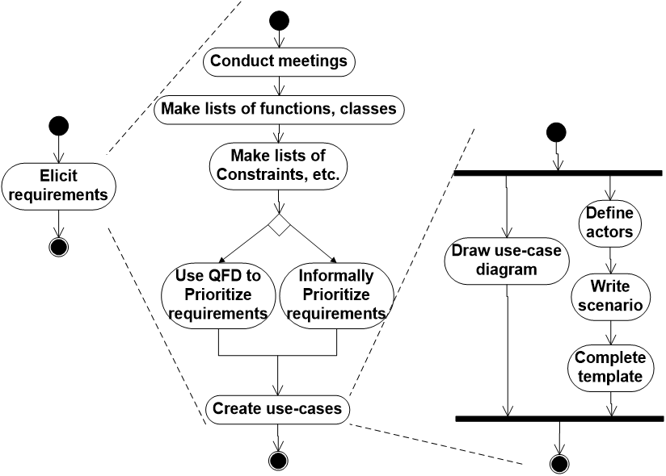

# Chapter 8: Understanding Requirements

## 8.1 需求分析概述

1. **需求分析的目标**
    - **描述客户需求**：清晰说明客户希望软件系统实现什么功能。
    - **为软件设计奠定基础**：为后续的软件设计提供依据。
    - **定义可验证的需求集合**：确保需求可以被测试与验证。
2. **需求分析的作用**
    
    需求分析使软件工程师（此时又称分析员 Analyst 或建模者 Modeler）能够：
    
    - **细化需求：**对需求工程早期阶段提出的基本需求进行进一步展开与细化。
    - **构建模型：**建立不同类型的模型，用于描述系统的多个方面：
        - 用户场景（User Scenarios）
        - 功能活动（Functional Activities）
        - 问题类别及其关系（Problem Classes and Relationships）
        - 系统行为与类行为（System and Class Behavior）
        - 数据流及其转换过程（Data Flow）
        - 软件需要满足的约束条件（Constraints）

## 8.2 需求分析流程

按时间阶段划分如下：

1. **起始（Inception）：** 通过询问一系列问题：
    - 建立对问题的初步理解
    - 识别寻求解决方案的人员
    - 明确期望的解决方案性质
    - 评估开发者与客户之间初步沟通与协作的有效性
2. **导出（Elicitation）：** 从所有利益相关者（Stakeholders）处获取需求 。
3. **细化（Elaboration）：** 构建**分析模型**（Analysis Model），以识别数据、功能和行为需求 。
4. **协商（Negotiation）：** 就开发人员和客户双方都认可的、切实可行的交付系统达成一致 。
5. **规格说明（Specification）：** 需求可以以一种或多种形式呈现，包括 ：
    - 书面文档（A written document）。
    - 模型集（A set of models）。
    - 形式化数学描述（A formal mathematical）。
    - 用户场景/用例集合（A collection of user scenarios / use-cases）。
    - 原型（A prototype）。
6. **确认（Validation）：** 检查内容的错误、解释偏差、缺失信息、不一致性（大型项目中的主要问题）以及冲突或无法实现的需求 。
7. **需求管理（Requirements management）：** 对整个过程中的需求变更进行管理 。

## 8.3 起始阶段

- **识别利益相关者：** 常用的追问方式是：“你认为我还需要找谁谈谈？” 。
- **认可多元视角：** 承认不同人员对系统有不同的看法和需求 。
- **推进协作：** 促进团队成员间的共同合作 。
- **首套“上下文无关”的问题：**
    - 谁发起了这项工作请求？
    - 谁将使用该解决方案？
    - 成功的解决方案将带来什么经济效益？
    - 是否还有其他满足您需求的解决方案来源？

## 8.4 导出阶段

构建软件系统时，最难的部分是决定构建什么 。

1. **面临的三大难题**
    - **范围问题（Scope）：** 系统的边界难以界定 。
    - **理解问题（Understanding）：** 客户对自身需求描述不精或开发者误解需求 。
    - **波动问题（Volatility）：** 需求随时间而改变 。
2. **相关活动**
    - 由软件工程师和客户共同举行并参加会议 。
    - 建立准备与参与规则，并建议会议议程（Agenda） 。
    - 由“协调员”（Facilitator，可以是客户、开发者或外部人员）主持会议 。
    - 使用“定义机制”（Definition mechanism），如工作表、活动挂图、墙贴、电子公告板、聊天室或虚拟论坛 。
    
    
    
3. **质量功能部署（Quality Function Deployment，QFD）**
    - QFD 是导出需求阶段的一种技术手段，强调确保质量（Quality）、明确功能（Function）、系统化配置（Deployment）。
    - QFD 将导出需求的过程拆解为三个具体的部署方向：
        - **功能部署（Function Deployment）：** 确定系统中每个功能的价值（由客户感知的价值）。
        - **信息部署（Information Deployment）：** 识别系统需要处理的数据对象和发生的事件。
        - **任务部署（Task Deployment）：** 检查系统在特定环境下的行为表现。
    - **优先级确定：** QFD 包含**价值分析（Value Analysis）**，帮助团队在导出的大量需求中进行权衡，确定哪些需求应该优先实现，哪些可以延后。
    - 在 QFD 中，需求被细分为三类：
        - 常规需求（Normal Requirements）
        - 期望需求（Expected Requirements）
        - 令人兴奋的需求（Exciting Requirements）
4. **非功能性需求（Non-Functional Requirements，NFR）**
    
    非功能性需求是指质量属性、性能属性、安全属性或一般的系统约束 。
    
    通过两阶段过程确定哪些 NFR 是兼容的：
    
    - 第一阶段： 创建矩阵，以每个 NFR 为列标题，系统软件工程（SE）准则为行标签 。通过这个矩阵，团队可以直观地看到每一个非功能性需求会受到哪些技术准则的影响，或者哪些准则在支撑特定的 NFR。
    - 第二阶段： 团队使用决策规则对 NFR 及其准则对进行分类（互补、重叠、冲突或独立），从而确定实施的优先级 。通过识别冲突和重叠，团队可以在开发初期就做出权衡（Trade-off），避免在项目后期才发现性能与安全无法兼得。
5. **导出阶段的工作成果**
    
    该阶段应产出以下成果 ：
    
    - 需求与可行性陈述（a statement of need and feasibility）。
    - 对系统或产品范围的界定陈述。
    - 参与需求导出的客户、用户及其他利益相关者名单。
    - 系统技术环境的描述。
    - 需求列表（最好按功能组织）及其适用的领域约束。
    - 描述系统在不同运行条件下使用情况的一组使用场景（usage scenarios）（即用例的初始形态）。
    - 为更好地定义需求而开发的任何原型（prototypes）。

## 8.5 细化阶段

1. **构建分析模型（Building the Analysis Model）**
    
    又称需求建模/需求分析模型。分析模型由以下四类元素组成：
    
    - **基于场景的元素（Scenario-based Elements）：** 用例（Use-case）、用例图（Use-case diagram）、活动图（Activity diagram）、泳道图（Swim lane diagram）。
    - **基于类的元素（Class-based Elements）：** 类图（Class diagram）、分析包（Analysis package）、CRC 模型、协作图（Collaboration diagram） 。
    - **基于行为的元素（Behavioral-based Elements）：** 状态图（State diagram）、序列图（Sequence diagram） 。
    - **面向流程的元素（Flow-orient Elements）：** 数据流图（Data flow diagram）、控制流图（Control flow diagram）、处理叙述（Processing narrative） 。
    
2. **分析模型在软件开发中的位置**
    
    ```python
    系统描述（System Description）→ 提供问题背景
    ↓
    分析模型（Analysis Model）→ 结构化表达需求
    ↓
    设计模型（Design Model）→ 指导系统实现
    ```
    
3. **构建分析模型的经验法则**
    - 模型应聚焦于问题或业务领域内可见的需求。
    - 抽象层次应相对较高。
    - 分析模型的每个元素都应有助于整体理解软件需求，并为系统的信息领域、功能和行为提供洞察。
    - 在需求分析阶段，推迟考虑现实问题（基础设施和其他非功能性模型），应在设计阶段再考虑。
    - 最小化系统耦合。
    - 确保分析模型对所有利益相关者都有价值。
    - 保持模型尽可能简单。
4. **分析模式（Analysis Pattern）**
    - 分析模式是一套针对特定领域问题的成熟分析方案，通过应用分析模式以构建分析模型。
    - 一个典型的分析模式通常包括：
        - 模式名称（Pattern Name）
        - 意图（Intent）：描述该模式旨在完成什么目标或代表什么核心业务逻辑。
        - 动机（Motivation）：通过具体的场景示例，展示该模式是如何解决实际业务问题的。
        - 约束力（Force）：影响模式使用的外部因素（如技术限制、业务规则）。
        - 上下文（Context）：应用该模式的前提环境，以及应用后预期能解决的外部问题。
        - 解决方案（Solution）：详细说明如何应用该模式来解决问题。
        - 后果（Consequences）：
        分析模式应用后的影响。这包括带来的好处，以及在应用过程中必须权衡的代价（Trade-offs）。
        - 设计（Design）：探讨如何通过已知的设计模式（Design Patterns）来实现这一分析模式，从逻辑模型转向物理实现。
        - 已知应用（Known Uses）：该模式在真实系统中的实际应用案例。
        - 相关模式（Related Patterns）：列出与其相关的其他分析模式。
5. **领域分析（Domain Analysis）**
    
    目标：从一个行业或领域中总结通用的软件需求，以便复用。
    
    
    

## 8.6 协商、规格说明与确认阶段

1. **协商需求（Negotiating Requirements）：** 识别关键利益相关者，确定每个人的“获胜条件（Win conditions）”，并努力达成一组令各方“双赢”的需求 。如果用户间无法达成一致，项目失败风险极高 。
2. **编写软件规格说明的原则**
    - 分层结构：文档应采用逐层深入的结构，从总体描述逐渐细化。
    - 统一符号：图形符号（Graphical Notation）统一、术语（Textual Terms）统一、避免同义词（Aliase）混用
    - 定义缩写：所有缩写（Acronyms）必须给出解释。
    - 提供目录和术语表：建议包含目录（Table of Contents）、索引（Index）、术语表（Glossary）。
    - 语言简洁明确，避免歧义。
    - 从读者角度写作：编写文档时需要问自己：“如果我不了解系统，我能看懂吗？”
3. **确认需求（Validating Requirements）的关键检查点：**
    - 需求是否与整体目标一致？
    - 抽象级别是否合适（是否包含了不当的技术细节）？
    - 需求是否真实必要，而非多余功能？
    - 每项需求是否界定清晰且无歧义？
    - 是否有来源归属（记录了具体提出的人员）？
    - 需求之间是否存在冲突？
    - 在当前技术环境下是否可实现？
    - 一旦实现，需求是否可测试？
    - 模型是否正确反映了系统信息、功能和行为？
    - 模型是否通过“划分（Partitioning）”展示了逐层深入的细节？
    - 是否使用了需求模式（Requirements patterns）来简化模型？
4. **需求监测（Requirements Monitoring）：** 在增量开发中尤为重要，包括分布式调试、运行时验证与确认、业务活动监控等 。