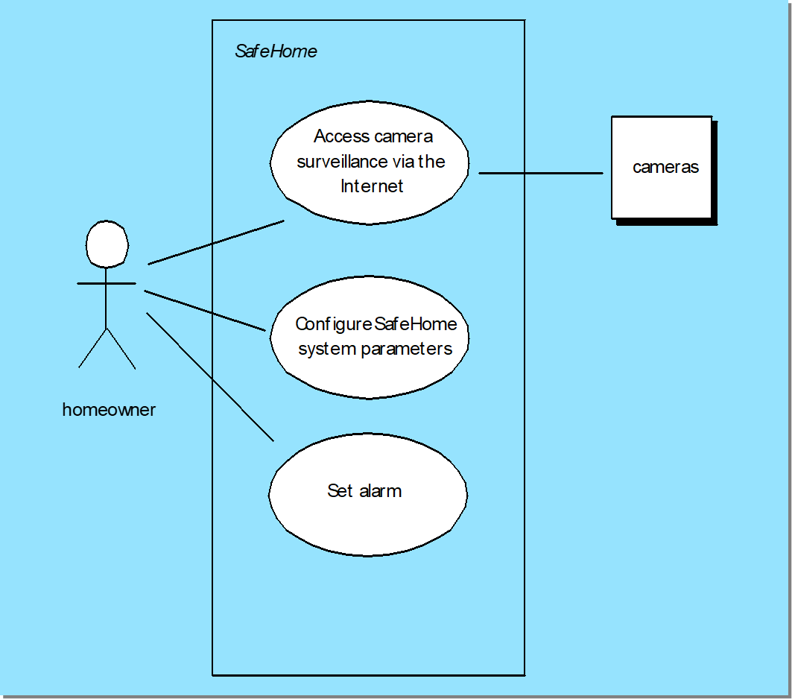

# Chapter 9: Requirements Modeling: Scenario-Based Methods

## 9.1 用例 Use-Case

1. **定义：**用例是描述系统使用主线的 **用户场景** 集合（A collection of **user scenarios** that describe the thread of usage of a system）。
2. **参与者**
    - 每个场景都要从参与者（Actor）的角度进行描述。
    - 参与者是指以某种方式与软件交互的人或设备，例如：用户、管理员、传感器、外部系统。
    - 一个用户可以在不同场景中扮演不同角色。
3. **时期：**在导出阶段初步形成，在细化阶段正式定义，在规格说明阶段作为成果归档。
4. 用例通常先以叙述形式（Narrative Form）编写，然后在需要时再转换为标准模板。
5. **用例开发（Developing a Use-Case）**
    
    编写用例时，需要考虑：
    
    - 谁是主要参与者？谁是次要参与者？
    - 参与者的目标是什么？
    - 故事开始前应存在哪些前置条件（Precondition）？
    - 参与者执行的主要任务或功能有哪些？
    - 描述故事时可能考虑哪些扩展？
    - 参与者的交互可能有哪些变化？
    - 参与者将获取、产生或更改哪些系统信息？
    - 参与者是否必须将外部环境的变化通知系统？
    - 参与者希望从系统得到什么信息？
    - 参与者是否希望被告知意外的变化？
6. **用例评审（Reviewing a Use-Case）**
    
    评审用例时，需要考虑：
    
    - 参与者是否可能采取其他操作？
    - 是否可能出现错误条件？如果出现错误，会发生什么？
    - 系统在某些情况下是否会表现出不同的行为？

## 9.2 用例的表示

1. **用例图（Use-case diagram）**
    - 描述系统、参与者以及用例之间的关系。
    
    
    
2. **活动图（Activity diagram）**
    - 对用例中的流程进行图形化表示。
    - 可以清晰展示系统操作流程、条件分支、用户行为顺序。
    
    
    
3. **泳道图（Swim lane diagram）**
    - 泳道图是活动图的一种扩展。在展示流程的同时，标明每个活动由谁负责。
    - 每个参与者拥有一个“泳道”。例如：用户、系统、某个模块。
    
    